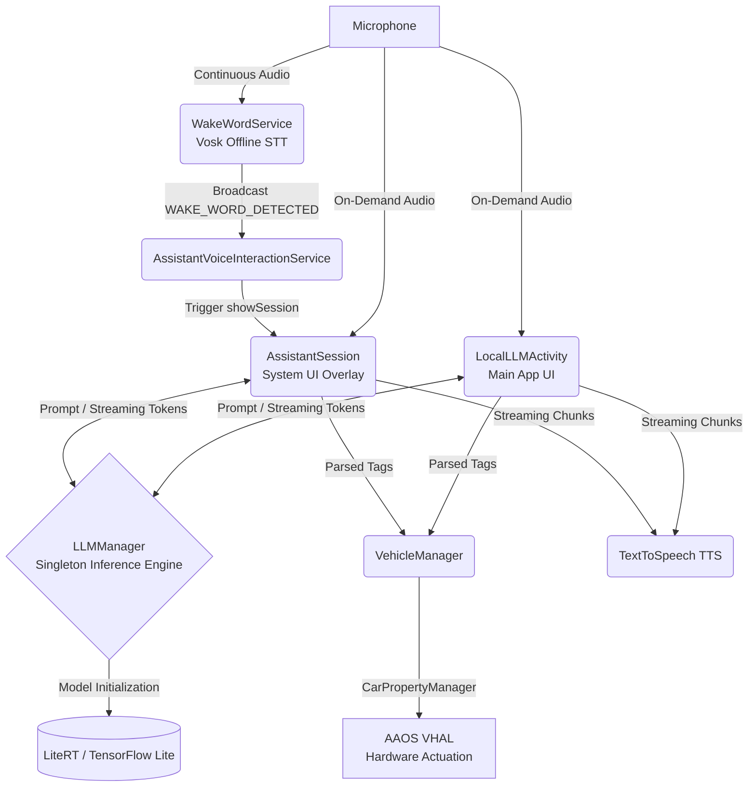
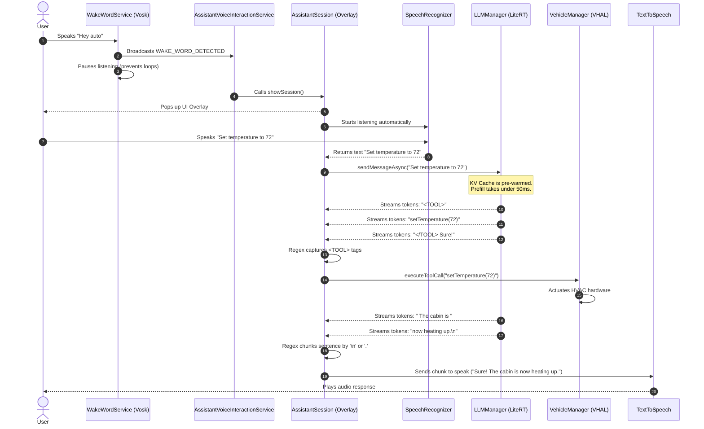

# Automotive AI Assistant: Architecture & AI Framework Description

This document provides an in-depth technical explanation of the AI framework, model configurations, memory management, and system architecture used within the Android Automotive AI Assistant.

---

## High-Level System Flow Diagram

The following diagram illustrates the overall flow of audio, tokens, and hardware actuations across the entire Automotive AI Assistant stack:

---

## 1. AI Framework & Engine Details

### The Framework: LiteRT (TensorFlow Lite)
The core intelligence of the application is powered by **Google's LiteRT (formerly TensorFlow Lite)** engine via the `com.google.ai.edge.litertlm` library. 
*   **Why LiteRT?**: It allows massive, multi-billion parameter quantized Large Language Models (like Gemma 2B or Qwen) to run completely offline on the vehicle's edge hardware (Snapdragon SA8155/SA8255).
*   **Hardware Backend**: By default, the `Backend.GPU()` is utilized to offload tensor calculations to the vehicle's GPU/NPU. If a model fails to load into VRAM or the GPU is unsupported, a seamless fallback to `Backend.CPU()` is initiated.

---

## 2. Model Parameters & Configuration

### The Context Window
*   **Parameter**: `maxTokens` (Configurable via UI).
*   **Default Value**: `512` tokens.
*   **Description**: This defines the absolute maximum size of the model's memory (Input System Prompt + User Query + AI Output). Because edge GPUs have limited memory, keeping the context window constrained prevents `OutOfMemory` crashes. 

### KV Cache Settings & Management
The Key-Value (KV) Cache is the mathematical memory the LLM uses to remember the conversation without having to re-read previous tokens.
*   **Persistence**: The KV Cache is tied to the `Conversation` object inside the `LLMManager` Singleton. We **do not** reset the conversation every time the assistant overlay is opened. This allows the model to retain context flawlessly across multiple voice queries.
*   **KV Cache Warmup (The Prefill Hack)**: Large Language Models suffer from "Prefill Latency," meaning they take several seconds to digest a massive System Prompt for the first time. To eliminate this, the application performs a **KV Cache Warmup**. As soon as the car boots and the model initializes, the app silently feeds the entire System Prompt into the model in the background. By the time the driver asks their first question, the System Prompt is already baked into the KV Cache, resulting in a lightning-fast Time-to-First-Token (TTFT) of under 50ms.

---

## 3. The System Prompt Architecture

### How is the System Prompt utilized?
The System Prompt is the fundamental set of instructions that governs the AI's behavior. Instead of a static string, the application uses a **Dynamic System Prompt** that injects real-time vehicle telemetry immediately before inference.

**The prompt architecture is split into three core pillars:**
1.  **Vehicle State Telemetry**: Real-time variables (Speed, HVAC Temperature, EV Battery Level, Outside Temperature, OBD Diagnostics) are dynamically read from the `VehicleManager` and injected into the prompt. This gives the AI absolute contextual awareness of the car.
2.  **Strict Tool Constraining**: The prompt forces the LLM to wrap hardware commands in XML tags (e.g., `<TOOL>setTemperature(VAL)</TOOL>`). It explicitly mandates that these tags must be generated *before* any conversational text.
3.  **Few-Shot Examples**: To guarantee reliable formatting, the prompt includes exact conversational patterns for Sightseeing, Smart Fuel Routing, Personalized Dining, and Diagnostics.

---

## 4. Android Services & Architectural Concepts

The application relies on highly specialized Android system components to bridge the gap between AI inference and seamless automotive user experience.

### 1. `WakeWordService` (The Passive Listener)
*   **Concept**: A continuous, offline acoustic listener.
*   **Implementation**: This is an Android **Foreground Service** utilizing the `FOREGROUND_SERVICE_TYPE_MICROPHONE` permission. It uses the **Vosk API** acoustic engine because Vosk reads the raw `AudioRecord` buffer silently. Standard Android APIs trigger a loud "beep" system sound when listening, which is unacceptable for passive background monitoring.

### 2. `AssistantVoiceInteractionService` (The System Hook)
*   **Concept**: The deep OS integration hook.
*   **Implementation**: This extends `VoiceInteractionService`, officially registering the application as the Android Automotive OS default digital assistant. When the Wake Word Service detects "Hey auto", it fires an intent to this service.

### 3. `AssistantSession` (The Active Overlay)
*   **Concept**: The UI overlay and active transcriber.
*   **Implementation**: Triggered by the `VoiceInteractionService`, this class draws a glassmorphism UI over any currently running app. It takes over the microphone using the native Android `SpeechRecognizer` for high-fidelity transcription. It actively parses `<TOOL>` tags from the streaming LLM tokens, stripping them from the UI and executing them via the `VehicleManager`.

### 4. `VehicleManager` (The Hardware Bridge)
*   **Concept**: The bridge to the vehicle's CAN bus.
*   **Implementation**: Connects to the AAOS `CarPropertyManager`. When the LLM decides to change the temperature, the `VehicleManager` receives the parsed XML command and injects it synchronously into the hardware abstraction layer (VHAL).

---

## Complete Interaction Flow Sequence

The following sequence details the ultra-low latency loop from the moment the user speaks the wake word to the moment the hardware reacts.

