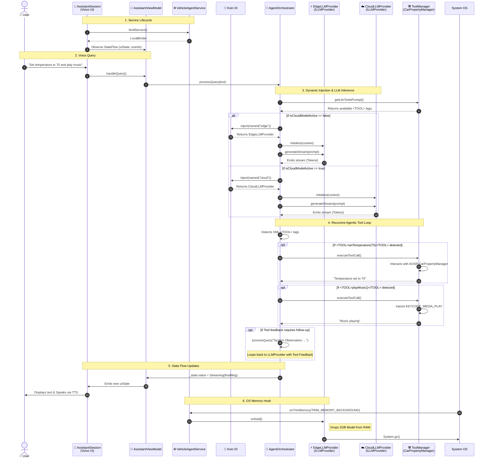

# Vehicle Assistant Architecture

This document outlines the architecture, components, and data flow of the **VehicleAssistant**. The application is designed to provide ultra-low latency, completely offline, LLM-powered voice assistance with deep, dynamic integration into the Android Automotive OS (AAOS) VHAL (Vehicle Hardware Abstraction Layer).

## Core Architecture Overview

### High-Level Architecture Stack

The following diagram illustrates the high-level boundaries and logical domains of the automotive AI stack, emphasizing the Strict MVVM and Foreground Service orchestration.

```mermaid
block-beta
  columns 1

  block:SLIDE
    columns 1
    
    block:VEA
      columns 1
      VEA_TITLE["<span style='font-size:20px; font-weight:bold; color:#FFFFFF;'>🚀 VehicleAssistant Package</span>"]
      
      block:L1["<span style='font-weight:bold; color:#FFFFFF;'>1. View & UI Layer</span>"]
        columns 3
        ACT["<span style='color:#FFFFFF'>📱 Configuration UI<br/>(LocalLLMActivity)</span>"]
        SESSION["<span style='color:#FFFFFF'>🎤 Voice Overlay<br/>(AssistantSession)</span>"]
        APPS["<span style='color:#FFFFFF'>🎵 Target Apps</span>"]
      end
      
      block:L2["<span style='font-weight:bold; color:#FFFFFF;'>2. ViewModel & Service Layer</span>"]
        columns 2
        VM["<span style='color:#FFFFFF'>🚦 AssistantViewModel</span>"]
        SVC["<span style='color:#FFFFFF'>⚙️ VehicleAgentService<br/>(Foreground & Memory)</span>"]
      end
      
      block:L3["<span style='font-weight:bold; color:#FFFFFF;'>3. Repository & Orchestrator Layer</span>"]
        columns 2
        ORCH["<span style='color:#FFFFFF'>🧠 AgentOrchestrator</span>"]
        DI["<span style='color:#FFFFFF'>💉 Koin DI Module</span>"]
      end
      
      block:L4["<span style='font-weight:bold; color:#FFFFFF;'>4. Data & Provider Layer</span>"]
        columns 4
        EDGE["<span style='color:#FFFFFF'>⚡ EdgeLLMProvider</span>"]
        CLOUD["<span style='color:#FFFFFF'>☁️ CloudLLMProvider</span>"]
        TM["<span style='color:#FFFFFF'>🛠️ ToolManager (RAG)</span>"]
        MEM["<span style='color:#FFFFFF'>💾 Context Memory</span>"]
      end
    end
    
    block:L5["<span style='font-weight:bold; color:#FFFFFF;'>5. AOSP Framework</span>"]
      columns 5
      CPM["<span style='color:#FFFFFF'>⚙️ CarPropertyManager</span>"]
      AM["<span style='color:#FFFFFF'>📱 ActivityManager</span>"]
      MEDIA["<span style='color:#FFFFFF'>🎵 MediaController</span>"]
      TTS["<span style='color:#FFFFFF'>🔊 TextToSpeech</span>"]
      STT["<span style='color:#FFFFFF'>🎤 SpeechRecognizer</span>"]
    end
    
    block:L6["<span style='font-weight:bold; color:#FFFFFF;'>6. Vehicle Hardware Layer</span>"]
      columns 2
      VHAL["<span style='color:#FFFFFF'>🌉 Vehicle HAL (CAN)</span>"]
      AUDIO["<span style='color:#FFFFFF'>🔈 Audio HAL</span>"]
    end
  end

  %% Connections
  L1 -- "<span style='color:#FFFFFF; font-weight:bold;'>Observes StateFlow</span>" --> L2
  L2 -- "<span style='color:#FFFFFF; font-weight:bold;'>Delegates Queries</span>" --> L3
  L3 -- "<span style='color:#FFFFFF; font-weight:bold;'>Invokes Interfaces</span>" --> L4
  L4 -- "<span style='color:#FFFFFF; font-weight:bold;'>Cross-Process IPC</span>" --> L5
  L5 -- "<span style='color:#FFFFFF; font-weight:bold;'>Hardware Bridge</span>" --> L6

  %% Professional Dark Theme Styling
  classDef appBox fill:#0F172A,stroke:#818CF8,stroke-width:2px;
  classDef vmBox fill:#0F172A,stroke:#38BDF8,stroke-width:2px;
  classDef repoBox fill:#0F172A,stroke:#A78BFA,stroke-width:2px;
  classDef dataBox fill:#0F172A,stroke:#F472B6,stroke-width:2px;
  classDef aospBox fill:#0F172A,stroke:#FBBF24,stroke-width:2px;
  classDef halBox fill:#0F172A,stroke:#34D399,stroke-width:2px;
  
  classDef layer1 fill:#000000,stroke:#818CF8,stroke-width:2px,stroke-dasharray:5 5;
  classDef layer2 fill:#000000,stroke:#38BDF8,stroke-width:2px,stroke-dasharray:5 5;
  classDef layer3 fill:#000000,stroke:#A78BFA,stroke-width:2px,stroke-dasharray:5 5;
  classDef layer4 fill:#000000,stroke:#F472B6,stroke-width:2px,stroke-dasharray:5 5;
  classDef layer5 fill:#000000,stroke:#FBBF24,stroke-width:2px,stroke-dasharray:5 5;
  classDef layer6 fill:#000000,stroke:#34D399,stroke-width:2px,stroke-dasharray:5 5;
  
  classDef veaWrapper fill:#111118,stroke:#A855F7,stroke-width:3px;
  classDef titleBox fill:transparent,stroke-width:0px;
  classDef slideBox fill:#09090B,stroke-width:0px;

  class ACT,SESSION,APPS appBox
  class VM,SVC vmBox
  class ORCH,DI repoBox
  class EDGE,CLOUD,TM,MEM dataBox
  class CPM,AM,MEDIA,TTS,STT aospBox
  class VHAL,AUDIO halBox
  
  class L1 layer1
  class L2 layer2
  class L3 layer3
  class L4 layer4
  class L5 layer5
  class L6 layer6
  
  class VEA veaWrapper
  class VEA_TITLE titleBox
  class SLIDE slideBox
```



## Detailed Data & Execution Flow (Architecture Topology)

This diagram outlines the complete end-to-end data pipeline, demonstrating the updated MVVM architecture, the Service layer, and how the LLM orchestration interacts with the AOSP Car APIs.

```mermaid
flowchart TD
    %% Professional Enterprise Theme
    classDef sysApp fill:#1E293B,stroke:#334155,stroke-width:2px,color:#F8FAFC,rx:8px,ry:8px;
    classDef aospAPI fill:#0EA5E9,stroke:#0284C7,stroke-width:2px,color:#FFFFFF,rx:8px,ry:8px,font-weight:bold;
    classDef logic fill:#8B5CF6,stroke:#7C3AED,stroke-width:2px,color:#FFFFFF,rx:8px,ry:8px,font-weight:bold;
    classDef ai fill:#10B981,stroke:#059669,stroke-width:2px,color:#FFFFFF,rx:8px,ry:8px,font-weight:bold;
    classDef hardware fill:#F59E0B,stroke:#D97706,stroke-width:2px,color:#FFFFFF,rx:8px,ry:8px,font-weight:bold;
    classDef config fill:#64748B,stroke:#475569,stroke-width:2px,color:#FFFFFF,rx:8px,ry:8px,font-weight:bold;

    subgraph Input ["1. User Input & AOSP Audio Framework"]
        MIC([🎙️ Microphone])
        TXT([⌨️ Keyboard])
        STT["🎤 android.speech.SpeechRecognizer<br/>(Cloud / On-Device)"]:::aospAPI
        VOSK["🗣️ Vosk WakeWord<br/>(Offline Acoustic Model)"]:::sysApp
    end

    subgraph AppUI ["2. View Layer (Ephemeral UI)"]
        SESSION["📱 AssistantSession<br/>(Voice Overlay Window)"]:::sysApp
        ACT["📱 LocalLLMActivity<br/>(Configuration UI)"]:::sysApp
    end

    subgraph ServiceLayer ["3. Foreground Service & Presentation"]
        SVC["⚙️ VehicleAgentService<br/>(Lifecycle & onTrimMemory)"]:::logic
        VM["🚦 AssistantViewModel<br/>(UI State Observer)"]:::logic
    end

    subgraph Orchestration ["4. Repository & Orchestration (Background)"]
        ORCH{"🧠 AgentOrchestrator<br/>(Agentic Loop Repository)"}:::logic
        KOIN["💉 Koin DI<br/>(Dependency Injector)"]:::logic
        TM["🛠️ ToolManager<br/>(Semantic Router & RAG)"]:::logic
        HANDLERS{"⚙️ ToolHandlers<br/>(HVAC, Media, Navigation, System)"}:::logic
        MEM["🧠 MemoryManager<br/>(Short-Term Context Window)"]:::logic
        JSON[("📄 vehicle_skills_registry.json<br/>(Zero-Code Definitions)")]:::config
        PREFS[("💾 SharedPreferences<br/>(Long-Term User Memory)")]:::config
    end

    subgraph Inference ["5. Providers & ML Execution"]
        ILLM["🔌 ILLMProvider<br/>(Abstraction Interface)"]:::logic
        EDGE["⚡ EdgeLLMProvider<br/>(Google LiteRT NPU/GPU)"]:::ai
        CLOUD["☁️ CloudLLMProvider<br/>(Gemini/Anthropic API)"]:::ai
        LOCAL[/"📱 Local LLMs<br/>(Gemma, Qwen)"/]:::ai
        CLOUD_SERVER[/"☁️ Server APIs"/]:::ai
    end

    subgraph Output ["6. AOSP Output & System Execution"]
        TTS["🔊 android.speech.tts.TextToSpeech<br/>(Audio Feedback)"]:::aospAPI
        CPM["⚙️ android.car.hardware.property.CarPropertyManager<br/>(Vehicle API)"]:::aospAPI
        CARSERVICE["🛠️ com.android.car.CarService<br/>(Binder IPC)"]:::aospAPI
        VHAL["🌉 Vehicle HAL<br/>(Hardware Abstraction)"]:::hardware
        CAN["🚗 CAN Bus / Physical ECUs"]:::hardware
        SPK([🔈 Speakers])
        INTENTS["📱 Android Framework<br/>(ActivityManager, MediaController)"]:::aospAPI
        MEDIA["🎵 Media & Browser Apps<br/>(ACTION_VIEW, KEYCODE_MEDIA_*)"]:::sysApp
        PHONE["📞 Telecom App<br/>(ACTION_DIAL)"]:::sysApp
    end

    %% Flow Mapping
    MIC -->|Audio Stream| STT
    MIC -->|Continuous Stream| VOSK
    VOSK -->|"Hey Auto" Trigger| SESSION
    STT -->|Transcribed Text| SESSION
    TXT -->|Raw String| ACT
    
    SESSION <==>|LocalBinder| SVC
    SVC -->|Holds Reference| VM
    SESSION <==>|Observes StateFlow| VM
    ACT <==>|User Query| MEM
    
    VM <==>|Delegates Query| ORCH
    MEM <==>|Context Window| ORCH
    
    JSON -.->|Injects Available Tools| TM
    JSON -.->|Maps VHAL IDs| CPM
    
    PREFS <==>|Reads/Writes Preferences| TM
    PREFS -.->|Injects Memory| ORCH
    
    ORCH -.->|"Resolves dependencies"| KOIN
    KOIN -.->|"Provides"| ILLM
    
    ILLM <|.. EDGE
    ILLM <|.. CLOUD

    ORCH ==>|"Context + Tools + History"| ILLM
    EDGE -->|"Hardware Delegate"| LOCAL
    CLOUD -->|"REST API Call"| CLOUD_SERVER
    
    LOCAL -->|"Token Stream"| EDGE
    CLOUD_SERVER -->|"Token Stream"| CLOUD
    ILLM ==>|"Response Stream"| ORCH
    
    ORCH -->|"StateFlow(Cleaned Text)"| VM
    VM -->|"TTS Sentence Chunks"| TTS
    TTS -->|"Synthesized Audio"| SPK
    
    ORCH -->|"<TOOL> Execution Tag"| TM
    TM -->|"Routes Command"| HANDLERS
    
    HANDLERS -->|"VHAL Payload"| CPM
    CPM -->|"Cross-Process IPC"| CARSERVICE
    CARSERVICE -->|"HIDL / AIDL"| VHAL
    VHAL -->|"Electrical Actuation"| CAN

    HANDLERS -->|"Standard Android Intent"| INTENTS
    INTENTS -->|"Launch & Media Routing"| MEDIA
    INTENTS -->|"Launch Dialer"| PHONE
    
    HANDLERS -.->|"Tool Feedback (Agentic Loop)"| ORCH
```

## Step-by-Step Processing Sequence

When the user speaks to the Assistant, the system follows a Strict MVVM data flow, utilizing Koin for dependency resolution and recursive agentic execution.



## Architectural Components Introduced in the Final Migration

### 1. Repository Pattern: `AgentOrchestrator.kt`
*   **Role**: The core "brain" of the application, completely separated from Android UI components.
*   **Purpose**: Previously, the `AssistantViewModel` handled thousands of lines of prompt injection, stream chunk parsing, recursive tool execution, and state manipulation. Now, `AgentOrchestrator` acts as the definitive data repository.
*   **Mechanism**: It exposes a Kotlin `StateFlow<OrchestratorState>` that the ViewModel trivially observes. It manages the complex recursive agentic loop (where tool outputs are fed back into the LLM up to 3 times) completely in the background.

### 2. Abstraction: `ILLMProvider.kt` & Koin Injection
*   **Role**: A unified interface decoupling the application logic from specific AI Inference Engines.
*   **Implementations**: 
    *   `EdgeLLMProvider.kt`: Wraps the Google LiteRT C++ bindings for the NPU/GPU execution of `.bin` flatbuffers.
    *   `CloudLLMProvider.kt`: Wraps REST APIs (Gemini/Anthropic) for cloud fallback functionality.
*   **Purpose**: Solves the "Singleton God Object" problem. `AgentOrchestrator` never directly instantiates an LLM. It relies on Koin (`AppModule`) to inject the appropriate `ILLMProvider` at runtime based on `LocalLLMActivity` configurations. This makes unit testing incredibly simple (we can now inject MockLLMProviders).

### 3. Foreground Service & Memory Safety: `VehicleAgentService.kt`
*   **Role**: A persistent Android Service that keeps the AI context alive outside of the UI lifecycle.
*   **Mechanism**: The `AssistantSession` UI now binds directly to this service. If the user swipes away the Assistant bottom sheet, the service guarantees that long-running tasks (like the model downloading or background tool execution) continue without interruption.
*   **`onTrimMemory` implementation**: The service implements `ComponentCallbacks2`. Android Automotive limits background apps severely. If the vehicle RAM fills up, the OS broadcasts `TRIM_MEMORY_BACKGROUND`. The service catches this and executes `EdgeLLMProvider.unload()`, freeing up the 2GB LLM cache.

### 4. Thin UI Controller: `AssistantViewModel.kt`
*   **Role**: A strict state emitter.
*   **Purpose**: Stripped of all logic, it now solely converts `OrchestratorState` into `AssistantUiState` for the `VoiceInteractionSession` overlay to render.

## Communication Medium Details

*   **View ↔ ViewModel**: Kotlin `StateFlow` (`uiState`) for continuous state updates (Idle, Listening, Thinking, Streaming). Kotlin `SharedFlow` (`events`) for one-off events (Toasts, Intent launching).
*   **ViewModel ↔ Service**: `LocalBinder`. The `VoiceInteractionSession` binds to the service via `bindService()` and directly accesses the ViewModel.
*   **Orchestrator ↔ Providers**: Koin Dependency Injection. `AgentOrchestrator` uses `getKoin().inject(named("cloud"))` or `named("edge")` to dynamically retrieve the correct provider at runtime based on user settings.
*   **Service ↔ Android OS**: Broadcast Intents for hardware button presses (PTT) and `ComponentCallbacks2` for system-level memory events.
