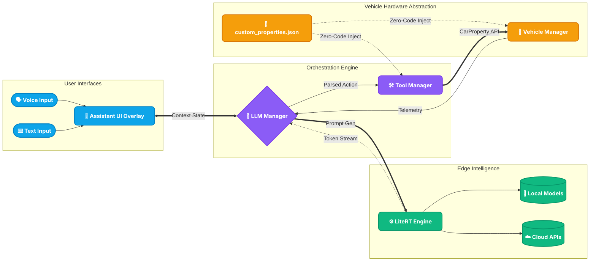
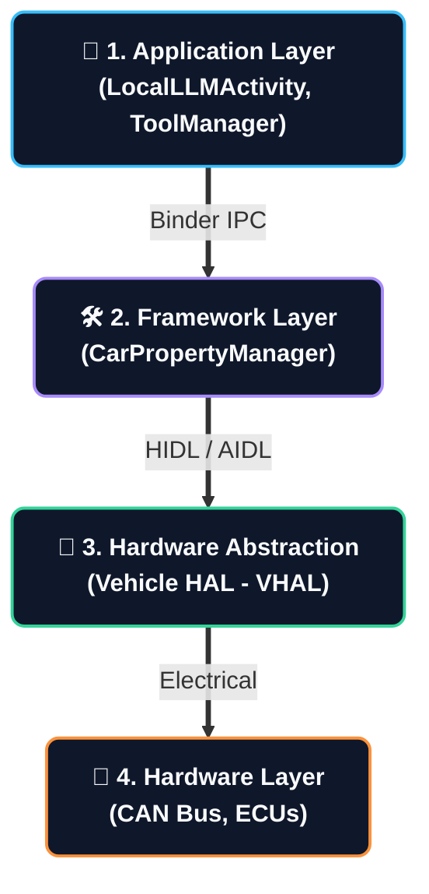
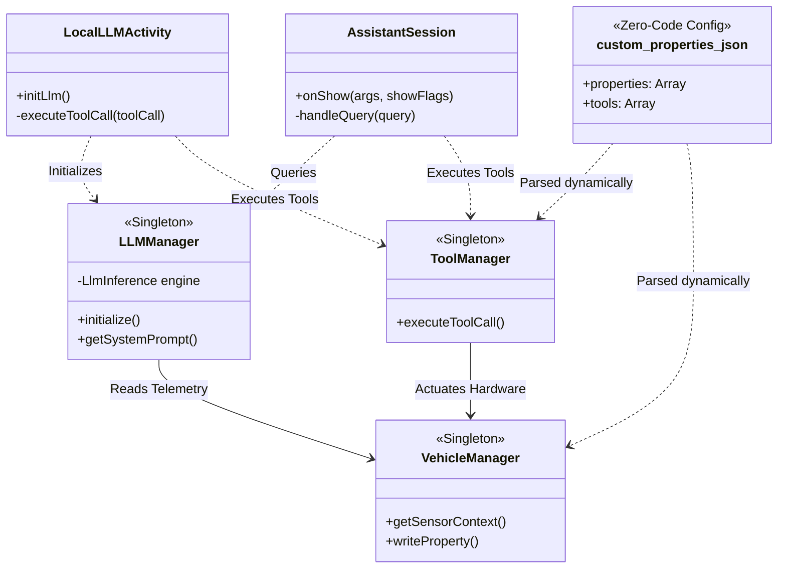

# Automotive AI Assistant Architecture

This document outlines the architecture, components, and data flow of the Android Automotive AI Assistant. The application is designed to provide ultra-low latency, completely offline, LLM-powered voice assistance with deep, dynamic integration into the Android Automotive OS (AAOS) VHAL (Vehicle Hardware Abstraction Layer).

## Core Architecture Overview

The system is built on a split architecture: a primary User Interface (`LocalLLMActivity`) for configuration and extended interactions, and a lightweight System UI Overlay (`AssistantSession`) for persistent, system-wide access. Both rely on a shared Singleton inference engine (`LLMManager`) to ensure rapid response times and consistent state.

### High-Level Component Diagram



### AOSP Integration Stack Diagram

The following diagram illustrates exactly where the LLM Engine Orchestrator resides within the Android Open Source Project (AOSP) architecture stack, and how natural language commands are translated down to the vehicle hardware via the Car API and Vehicle HAL.

```mermaid
flowchart TD
    %% Professional Styling
    classDef app fill:#0F172A,stroke:#38BDF8,stroke-width:3px,color:#F8FAFC,rx:8px,ry:8px,font-weight:bold;
    classDef api fill:#1E293B,stroke:#94A3B8,stroke-width:2px,color:#CBD5E1,rx:8px,ry:8px;
    classDef framework fill:#1E293B,stroke:#A78BFA,stroke-width:2px,color:#E6D5B8,rx:8px,ry:8px;
    classDef hal fill:#1E293B,stroke:#34D399,stroke-width:2px,color:#A7F3D0,rx:8px,ry:8px;
    classDef hw fill:#1E293B,stroke:#FB923C,stroke-width:2px,color:#FED7AA,rx:8px,ry:8px;

    APP_LLM["🚀 AI System Apps<br/>(LocalLLMActivity, ToolManager)"]:::app
    
    CPM["⚙️ Car API Layer<br/>(CarPropertyManager)"]:::api
    
    CS["🛠️ Android Framework<br/>(com.android.car.CarService)"]:::framework
    
    VHAL["🌉 Hardware Abstraction<br/>(Vehicle HAL)"]:::hal
    
    CAN["🚗 Hardware Layer<br/>(CAN Bus & ECUs)"]:::hw

    %% Data flow mapping
    APP_LLM ==>|1. Tool Execution (Write) / Telemetry (Read)| CPM
    CPM ==>|2. Cross-Process Binder IPC| CS
    CS ==>|3. Hardware Interface (HIDL / AIDL)| VHAL
    VHAL ==>|4. Raw CAN Payload / Electrical Signals| CAN
```

### Vertical Layer Stack

For a simplified view of the system architecture from a pure software-stack perspective:



### Class & Structural Block Diagram

The following diagram illustrates the class relationships, dependencies, and interfaces between the core components of the application.



## Zero-Code Dynamic AOSP Property & Tool Handling

One of the most powerful features of this architecture is its **JSON-driven Zero-Code engine**. The application dynamically handles AOSP (Android Open Source Project) and OEM-specific Vendor Properties without requiring you to write or compile Kotlin code for every new feature.

At startup, the `ToolManager` and `VehicleManager` parse the `assets/custom_properties.json` file. This file acts as the bridge between the LLM's natural language capabilities and the car's native VHAL network.

### 1. Dynamic Sensor Reading (Properties)
When the LLM needs context (e.g., "What is the battery level?"), `VehicleManager` automatically iterates through all objects defined in the `"properties"` JSON array. It subscribes to these `property_id` values via the `CarPropertyManager` and dynamically translates them into human-readable strings injected into the LLM's System Prompt.

**Example: AOSP vs Vendor Properties**
- **AOSP Standard:** `291504905` (EV Battery Level). Android natively knows what this is.
- **Vendor Custom:** `555000123` (OEM Custom Sensor). Even though Android doesn't natively map this ID to a name, the app will blindly read it and pass the raw `FLOAT`/`INT` to the LLM based on how you define it in the JSON.

### 2. Dynamic Hardware Actuation (Tools)
When the LLM generates a tool call (e.g., `<TOOL>setAmbientLight(5)</TOOL>`), the `ToolManager` cross-references the command against the `"tools"` JSON array.
If it finds a matching `GENERIC_VHAL_WRITE` handler, the `ToolManager` uses reflection to securely inject the specified data payload directly into the target `property_id` on the CAN bus via `CarPropertyManager.setProperty()`.

---

## How to Add a New Action and Property

Adding a new feature to the assistant is a simple two-step process using `custom_properties.json` and, optionally, `LLMManager.kt` if you want to explicitly guide the AI's behavior.

### Scenario: Adding Control for the Sunroof

#### Step 1: Update `custom_properties.json`
To give the AI the ability to open the sunroof, define a new tool in the JSON array. You need the exact AOSP or Vendor VHAL Property ID (e.g., `320865540` for `WINDOW_POS`).

```json
{
  "prompt_string": "<TOOL>openSunroof()</TOOL>",
  "handler_type": "GENERIC_VHAL_WRITE",
  "property_id": 320865540,
  "data_type": "INT",
  "area_id": 16, 
  "value_to_write": "100",
  "success_message": "Opening the sunroof now."
}
```
* **`prompt_string`**: The exact syntax you want the LLM to output.
* **`handler_type`**: `GENERIC_VHAL_WRITE` tells the `ToolManager` to bypass custom Kotlin logic and automatically write the value to the VHAL.
* **`property_id`**: The target VHAL ID.
* **`area_id`**: The specific zone (e.g., `16` represents the roof zone in AOSP).
* **`value_to_write`**: The payload (e.g., `100` means 100% open).

#### Step 2: (Optional) Guide the AI in `LLMManager.kt`
While the JSON injects the tool definition into the prompt automatically, you can add a strict rule in `LLMManager.getSystemPrompt()` to ensure the LLM understands *when* to use it, especially if the prompt length is constrained.

Open `LLMManager.kt` and locate the `getSystemPrompt()` method. Add a new contextual rule:

```kotlin
val isSunroof = q.contains("sunroof") || q.contains("roof") || q.contains("sky")

if (isSunroof || q.isEmpty()) {
    basePrompt.append("8. SUNROOF: If the user asks to open the sunroof or see the sky, you MUST output the EXACT syntax <TOOL>openSunroof()</TOOL>.\n")
}
```

That's it! Restart the app, and the AI will now securely actuate the sunroof when asked, without you needing to manually implement `CarPropertyManager` callbacks.

## Main Components Detail

### 1. LiteRT (LiteRT-LM) Integration Deep Dive
The core local intelligence of the application is powered by **Google's LiteRT** (formerly TensorFlow Lite), specifically the `com.google.ai.edge.litertlm` library.

- **C++ JNI Bridge**: The Kotlin `LLMManager` acts as a thin wrapper over the underlying C++ LiteRT engine (`liblitertlm_jni.so`). This ensures that the heavy matrix multiplication required for LLM inference happens natively, bypassing the Android Dalvik Virtual Machine for maximum performance.
- **Hardware Delegates**: LiteRT dynamically routes subgraphs of the neural network to the most efficient hardware available:
  - **GPU Delegate (OpenCL/OpenGL)**: The default backend. It compiles shader programs on the first run to execute LLM operations in parallel on the Adreno GPU.
  - **CPU/XNNPACK**: Used as a fallback or for models not fully supported by the GPU. It utilizes highly optimized ARM NEON vector instructions.
  - **NPU (Hexagon DSP)**: For specific Qualcomm-optimized models, LiteRT uses FastRPC (`libcdsprpc.so`) to offload INT4/INT8 quantized graphs directly to the Hexagon NPU for extreme power efficiency.
- **Native KV Caching**: LiteRT maintains the Key-Value (KV) cache persistently in native RAM (C++ space) rather than JVM memory. This prevents Android Garbage Collection pauses during token generation and allows rapid multi-turn conversations without needing to recompute the entire prompt history.

### 2. `LLMManager.kt` (Orchestration Engine)
- **Role**: Manages the `LiteRT` (`litertlm`) execution for on-device inference (e.g. Gemma, Qwen). Uses a native persistent Key-Value (KV) cache to maintain conversation history across multi-turn interactions.
- **Dynamic Context**: Constructs the System Prompt by combining the base persona, live `VehicleManager` sensor strings, and the dynamically loaded `ToolManager` JSON constraints.

### 2. `ToolManager.kt` (Execution Engine)
- **Role**: Parses the JSON configuration file (`custom_properties.json`) into active `ToolDefinition` objects.
- **RAG Execution**: Employs a semantic similarity engine. When the user asks a question, `ToolManager.getLlmToolsPrompt(query)` filters the available tools based on relevance to ensure the LLM is not overwhelmed with irrelevant tools, improving Time-To-First-Token (TTFT) latency.
- **Regex Interception**: Evaluates the LLM's streaming token output using a `<TOOL>(.*?)</TOOL>` Regex. If a match is found, it strips it from the UI, executes the JSON-defined action, and pushes the `success_message` to the TTS buffer.

### 3. `VehicleManager.kt` (Hardware Bridge)
- **Role**: Connects directly to the Android Automotive `CarPropertyManager`.
- **Read**: Translates raw VHAL float/int arrays (like `22.5` from `HVAC_TEMPERATURE_SET`) into human-readable strings (e.g., "The Driver side temperature is 22.5 degrees") and exposes them via `getSensorContext()`.
- **Write**: Translates `ToolManager` intents into hardware actuation via `carPropertyManager.setProperty(PropertyId, AreaId, Value)`.

### 4. `AssistantSession.kt` & `WakeWordService.kt` (UI and Audio)
- **WakeWordService**: Uses `Vosk` (Offline Acoustic Models) to constantly listen for "Hey Auto" without draining the battery or emitting system "beeps".
- **AssistantSession**: The transparent bottom-sheet overlay. It orchestrates the Android `SpeechRecognizer` for transcription, pushes the text to `LLMManager`, and streams the resulting tokens through a sentence-boundary regex to Android `TextToSpeech` (`TTS`).

## Performance & Latency Optimizations

To achieve highly responsive execution on an automotive SoC, the architecture implements several aggressive latency optimizations:

### 1. Differential KV Cache Preservation (Local Models)
Originally, injecting the massive 1,500-token System Prompt (containing all the vehicle rules and tools) forced the LiteRT engine to recompute the entire context window, causing 3-4 second delays on every turn. 
**Optimization**: The massive System Prompt is now only injected on the **first turn** (Prefill phase). For all follow-up questions, the app only passes the delta (the new user query). The LiteRT Key-Value (KV) cache holds the original prompt in native RAM, dropping follow-up response times (TTFT) to **sub-second levels**.

### 2. Socket-Level SSE Streaming (Cloud Models)
**Optimization**: The `GeminiManager` bypasses standard synchronous HTTP calls by utilizing **Server-Sent Events (SSE)**. The app reads the raw TCP socket buffer in real-time, displaying words on the screen the exact millisecond they leave the server, dropping cloud latency to **< 1.5s**.

### 3. Semantic Tool RAG Filtering
**Optimization**: To prevent system prompt bloat, the `ToolManager` dynamically filters out irrelevant tools based on the user's query. By only injecting contextually relevant tools into the prompt, the token count is significantly reduced, directly accelerating the prefill compute time.

### 4. Sentence-Boundary TTS Streaming (Perceived Latency)
**Optimization**: A custom regex-based streaming chunker intercepts the LLM output. As soon as the LLM generates a punctuation mark (`.` or `?`), that single sentence is instantly pushed to the Android `TextToSpeech` engine. The car starts talking to the driver while the LLM is still quietly generating the rest of the response in the background, making the interaction feel instantaneous.

### Current TTFT Metrics
*   **Cloud APIs**: `< 1.5s` (SSE Streaming)
*   **Entry-Level Local** (e.g., SmolLM 135M): `< 1.0s` (GPU/CPU)
*   **Mid-Range Local** (e.g., Qwen 2.5 1.5B): `1.5s - 2.5s` (GPU)
*   **Premium Local** (e.g., Gemma 4 E2B): `2.5s - 3.5s` (GPU/NPU)

## Future Scaling Plan

As the underlying automotive hardware and edge-AI models evolve, the architecture is designed to scale in the following directions:

### 1. Agentic Workflows & Multi-Step Reasoning
Currently, the assistant operates on a direct Request-Response paradigm. Future scaling will introduce **Agentic loops** (e.g., ReAct). When given a high-level command like *"Prep the car for a road trip"*, the LLM will recursively break this down into multiple hidden steps: check fuel -> read tire pressure -> set climate control -> plot navigation, executing and verifying each tool before speaking to the user.

### 2. Multi-Modal Cabin Awareness (Vision & Audio)
Expanding the `VehicleManager` inputs to include multi-modal data. By feeding in-cabin camera frames (via `Camera2 API`) and microphone sentiment analysis into vision-capable edge models (like Gemini Nano Multi-modal), the assistant will be able to read driver fatigue, recognize passengers, and answer visual questions (e.g., *"Did I leave my bag in the back seat?"*).

### 3. Local Vector Database (Advanced RAG)
Replacing the current static tool array with an on-device embedded Vector Database (e.g., SQLite-vec or FAISS ported via JNI). This will allow the manufacturer to embed the entire 500-page Vehicle Owner's Manual as vector embeddings. The assistant will dynamically retrieve highly specific repair, maintenance, and dashboard warning light information completely offline.

### 4. Edge Fine-Tuning (LoRA Adapters)
Instead of relying on a monolithic base model, future versions will utilize **Low-Rank Adaptation (LoRA)** loading. The vehicle can dynamically swap small (20MB) LoRA weights at runtime to radically change the assistant's persona, support regional dialects, or specialize in specific automotive domains (e.g., loading an Off-Road LoRA when 4x4 mode is engaged).

### 5. Advanced NPU/DSP Memory Management
To push Time-To-First-Token (TTFT) latency even lower (sub-500ms), future architecture scaling will involve migrating the massive LLM Key-Value (KV) cache directly into the ultra-fast Hexagon DSP memory or EdgeTPU SRAM, bypassing standard Android RAM constraints and eliminating prompt-processing bottlenecks entirely.
