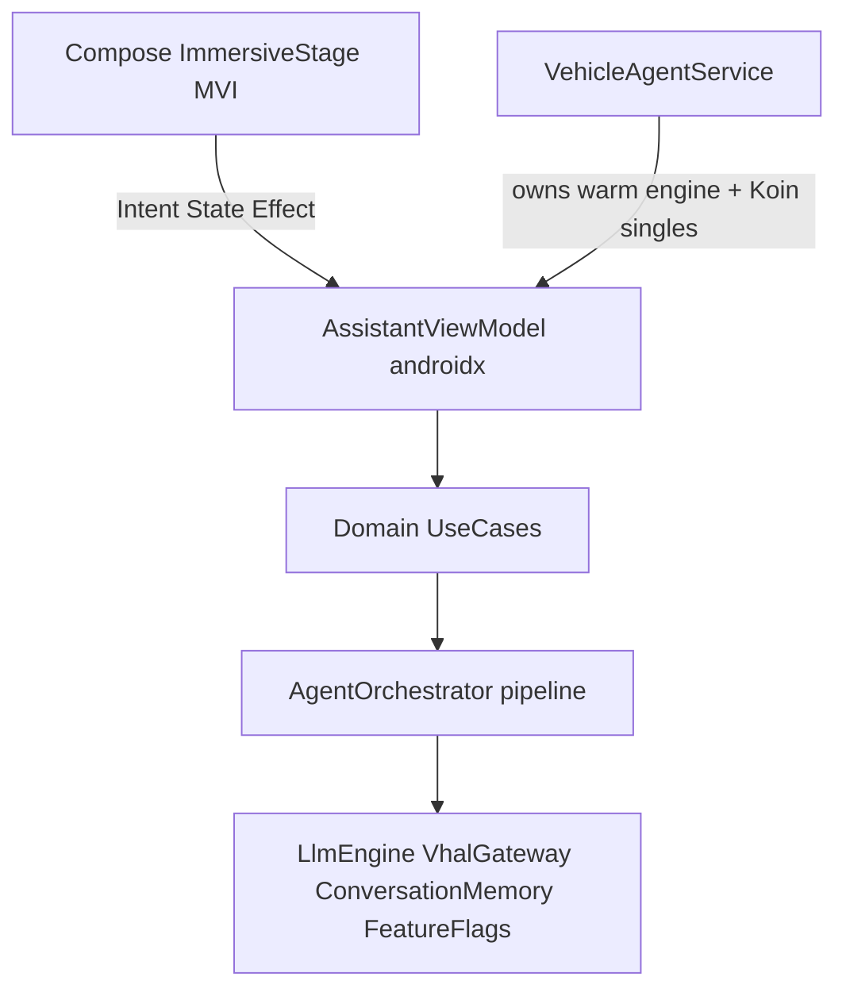

# Vehicle Assistant Architecture

In-vehicle **local** AAOS assistant: warm LiteRT inference, VoiceInteraction overlay, VHAL tools.

Aligned with Google [JetPacker](https://github.com/android/ai-samples/tree/main/jetpacker) patterns (providers, readiness, feature flags, hybrid prefer-on-device) adapted for automotive + LiteRT — not Firebase/AICore.

## Current + target shape

### Layers

| Layer | Responsibility |
|-------|----------------|
| `:assistant` Compose | Face/chrome renderer + `AssistantStageStore` MVI; `AssistantBackend` events only |
| Presentation | `AssistantViewModel` + `AssistantUiIntent` over shared orchestrator |
| Domain | `ProcessQueryUseCase`, `FollowUpUseCase`, `ExecuteToolUseCase`, `SpeechPresenter` |
| Data ports | `LlmEngine` / `LiteRtLlmEngine`, `VhalGateway`, `ConversationMemory`, `AssistantFeatureFlags` |
| Service | `VehicleAgentService` — warm process, Koin-wired audio + VM + orchestrator |

### Presentation MVI (chosen)

- **UI stage:** `Intent → reduce → StageState + StageEffect` in `:assistant` (`mvi/`)
- **Agent brain:** streaming **pipeline** (not Redux per token) — eager `</TOOL>` execution, sentence TTS

### JetPacker adopt / skip

**Adopt:** Provider+Impl, `EngineStatus` readiness, FeatureFlags, constructor DI (Koin), streaming APIs, prefer-edge routing.  
**Skip:** Firebase AI Logic, AICore Gemini Nano as primary, full multi-feature Gradle explosion, Hilt rewrite.

## Runtime voice path

1. Wake word (Vosk) → `AssistantSession` VIS → Compose immersive stage  
2. `VehicleAgentAssistantBackend` arms mic (~250ms handoff) via `IAudioManager`  
3. Final transcript → `AssistantViewModel.dispatch(SubmitQuery)` → orchestrator  
4. FollowUpRouter / UseCase may skip LLM; else edge/cloud stream  
5. Tokens → UI + sentence TTS; complete `<TOOL>…</TOOL>` runs eagerly mid-stream  
6. VHAL / intents via ToolManager handlers  

## Key files

- [`AgentOrchestrator.kt`](app/src/main/java/com/tcs/vehicleassistant/repository/AgentOrchestrator.kt) — agentic loop  
- [`LiteRtLlmEngine.kt`](app/src/main/java/com/tcs/vehicleassistant/llm/LiteRtLlmEngine.kt) / [`EngineStatus.kt`](app/src/main/java/com/tcs/vehicleassistant/llm/EngineStatus.kt)  
- [`AssistantFeatureFlags.kt`](app/src/main/java/com/tcs/vehicleassistant/core/flags/AssistantFeatureFlags.kt)  
- [`AssistantStageStore.kt`](assistant/src/main/java/com/assistant/ui/assistant/mvi/AssistantStageStore.kt)  
- [`vehicle_skills_registry.json`](app/src/main/assets/vehicle_skills_registry.json) — zero-code tools  

## TTFR budgets (warm edge)

| Milestone | Target |
|-----------|--------|
| Mic ready after wake | &lt;300ms |
| STT finalize after speech end | &lt;800ms |
| TTFT | &lt;1.5–2s |
| First audible TTS | first sentence |
| VHAL action | as soon as tool tag closes |

See [docs/architecture/decoupling_roadmap.md](docs/architecture/decoupling_roadmap.md) and [docs/performance/automotive_latency_optimizations.md](docs/performance/automotive_latency_optimizations.md).
