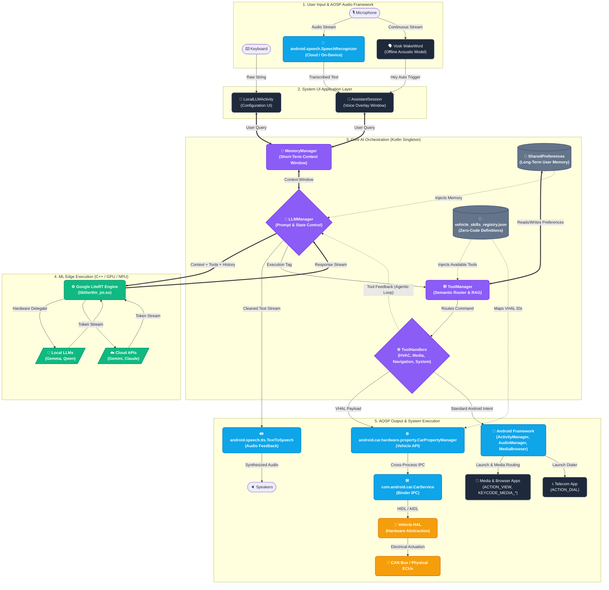
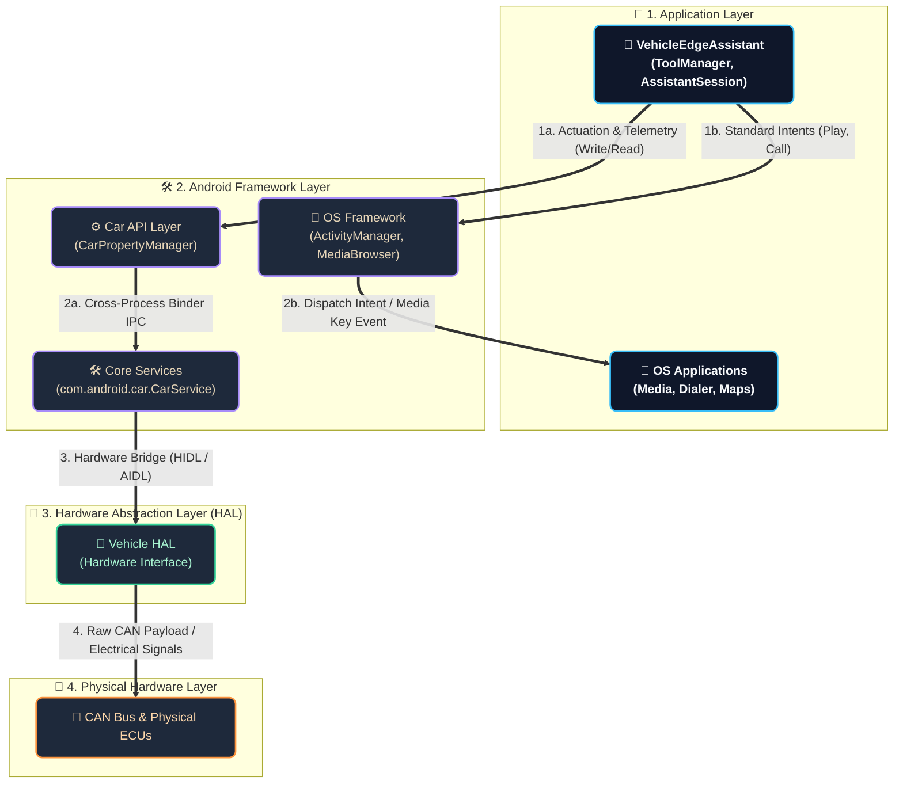
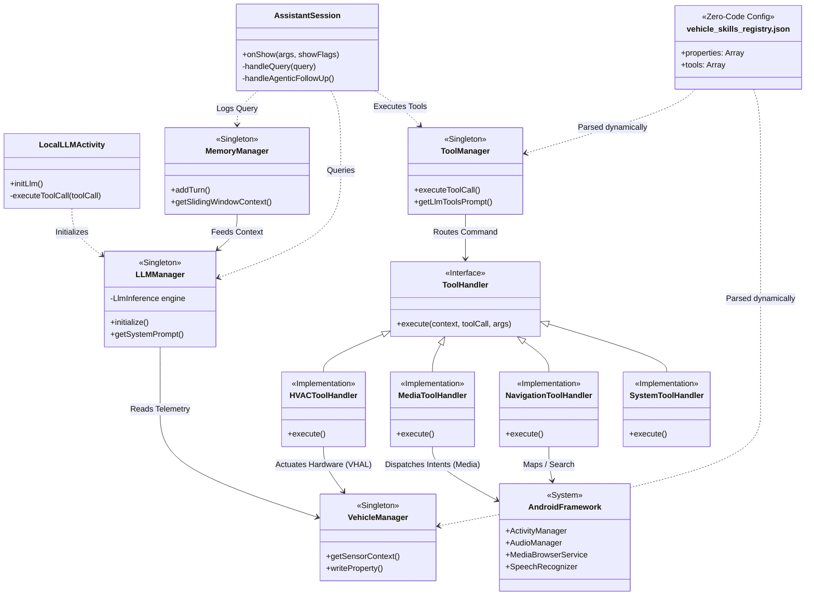
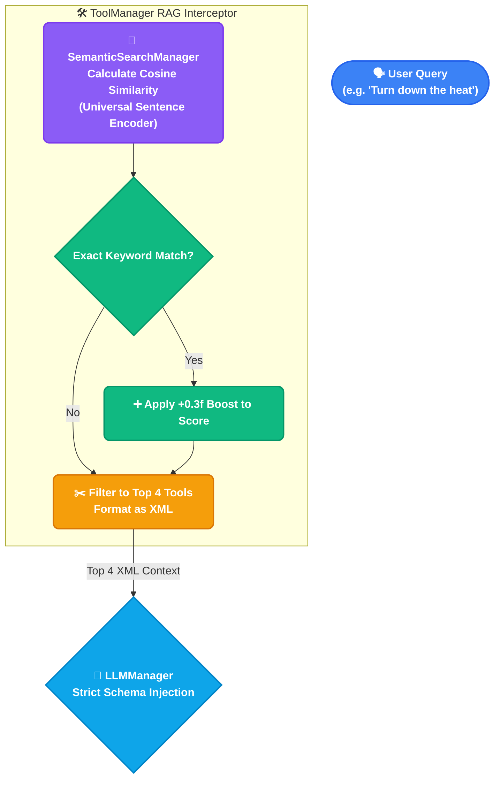

# VehicleEdgeAssistant Architecture

This document outlines the architecture, components, and data flow of the **VehicleEdgeAssistant**. The application is designed to provide ultra-low latency, completely offline, LLM-powered voice assistance with deep, dynamic integration into the Android Automotive OS (AAOS) VHAL (Vehicle Hardware Abstraction Layer).

## Core Architecture Overview

### High-Level Architecture Stack

The following diagram illustrates the high-level boundaries and logical domains of the automotive AI stack, from the user-facing application layer down to the CAN bus hardware.

```mermaid
block-beta
  columns 1

  block:SLIDE
    columns 1
    
    block:VEA
      columns 1
      VEA_TITLE["<span style='font-size:20px; font-weight:bold; color:#FFFFFF;'>🚀 VehicleEdgeAssistant Package</span>"]
      
      block:L1["<span style='font-weight:bold; color:#FFFFFF;'>1. Application Layer</span>"]
        columns 3
        ACT["<span style='color:#FFFFFF'>📱 Configuration UI</span>"]
        SESSION["<span style='color:#FFFFFF'>🎤 Voice Overlay</span>"]
        APPS["<span style='color:#FFFFFF'>🎵 Target Apps</span>"]
      end
      
      block:L2["<span style='font-weight:bold; color:#FFFFFF;'>2. GenAI Orchestrator Engine</span>"]
        columns 4
        VOSK["<span style='color:#FFFFFF'>🗣️ Vosk WakeWord</span>"]
        LLM["<span style='color:#FFFFFF'>🧠 LiteRT Edge LLM</span>"]
        TM["<span style='color:#FFFFFF'>🛠️ ToolManager RAG</span>"]
        MEM["<span style='color:#FFFFFF'>💾 Context Memory</span>"]
      end
    end
    
    block:L3["<span style='font-weight:bold; color:#FFFFFF;'>3. AOSP Framework</span>"]
      columns 5
      CPM["<span style='color:#FFFFFF'>⚙️ CarPropertyManager</span>"]
      AM["<span style='color:#FFFFFF'>📱 ActivityManager</span>"]
      MEDIA["<span style='color:#FFFFFF'>🎵 MediaBrowser /<br/>MediaController</span>"]
      TTS["<span style='color:#FFFFFF'>🔊 TextToSpeech<br/>(TTS)</span>"]
      STT["<span style='color:#FFFFFF'>🎤 SpeechRecognizer<br/>(STT)</span>"]
    end
    
    block:L4["<span style='font-weight:bold; color:#FFFFFF;'>4. Vehicle Hardware Layer</span>"]
      columns 2
      VHAL["<span style='color:#FFFFFF'>🌉 Vehicle HAL (CAN)</span>"]
      AUDIO["<span style='color:#FFFFFF'>🔈 Audio HAL</span>"]
    end
  end

  %% Connections
  L1 -- "<span style='color:#FFFFFF; font-weight:bold;'>Display Updates / Android Intents</span>" --> L2
  L2 -- "<span style='color:#FFFFFF; font-weight:bold;'>Cross-Process Binder IPC / Intents</span>" --> L3
  L3 -- "<span style='color:#FFFFFF; font-weight:bold;'>Hardware Bridge (HIDL / AIDL)</span>" --> L4

  %% Professional Dark Theme Styling
  classDef appBox fill:#0F172A,stroke:#818CF8,stroke-width:2px;
  classDef genaiBox fill:#0F172A,stroke:#38BDF8,stroke-width:2px;
  classDef aospBox fill:#0F172A,stroke:#FBBF24,stroke-width:2px;
  classDef halBox fill:#0F172A,stroke:#34D399,stroke-width:2px;
  
  classDef layer1 fill:#000000,stroke:#818CF8,stroke-width:2px,stroke-dasharray:5 5;
  classDef layer2 fill:#000000,stroke:#38BDF8,stroke-width:2px,stroke-dasharray:5 5;
  classDef layer3 fill:#000000,stroke:#FBBF24,stroke-width:2px,stroke-dasharray:5 5;
  classDef layer4 fill:#000000,stroke:#34D399,stroke-width:2px,stroke-dasharray:5 5;
  
  classDef veaWrapper fill:#111118,stroke:#A855F7,stroke-width:3px;
  classDef titleBox fill:transparent,stroke-width:0px;
  classDef slideBox fill:#09090B,stroke-width:0px;

  class ACT,SESSION,APPS appBox
  class VOSK,LLM,TM,MEM genaiBox
  class CPM,AM,MEDIA,TTS,STT aospBox
  class VHAL,AUDIO halBox
  
  class L1 layer1
  class L2 layer2
  class L3 layer3
  class L4 layer4
  
  class VEA veaWrapper
  class VEA_TITLE titleBox
  class SLIDE slideBox
```



### Detailed Data & Execution Flow



### AOSP Vertical Integration Stack

The following diagram illustrates exactly where the LLM Engine Orchestrator resides within the Android Open Source Project (AOSP) architecture stack. It combines the high-level software layers (Application -> Framework -> HAL -> Hardware) with the specific APIs used to translate natural language commands down to the vehicle hardware.



### Class & Structural Block Diagram

The following diagram illustrates the class relationships, dependencies, and interfaces between the core components of the application.



## Zero-Code Dynamic AOSP Property & Tool Handling

One of the most powerful features of this architecture is its **JSON-driven Zero-Code engine**. The application dynamically handles AOSP (Android Open Source Project) and OEM-specific Vendor Properties without requiring you to write or compile Kotlin code for every new feature.

At startup, the `ToolManager` and `VehicleManager` parse the `assets/vehicle_skills_registry.json` file. This file acts as the bridge between the LLM's natural language capabilities and the car's native VHAL network.

### 1. Dynamic Sensor Reading (Properties)
When the LLM needs context (e.g., "What is the battery level?"), `VehicleManager` automatically iterates through all objects defined in the `"properties"` JSON array. It subscribes to these `property_id` values via the `CarPropertyManager` and dynamically translates them into human-readable strings injected into the LLM's System Prompt.

**Example: AOSP vs Vendor Properties**
- **AOSP Standard:** `291504905` (EV Battery Level). Android natively knows what this is.
- **Vendor Custom:** `555000123` (OEM Custom Sensor). Even though Android doesn't natively map this ID to a name, the app will blindly read it and pass the raw `FLOAT`/`INT` to the LLM based on how you define it in the JSON.

### 2. Dynamic Hardware Actuation (Tools)
When the LLM generates a tool call (e.g., `<TOOL>setAmbientLight(5)</TOOL>`), the `ToolManager` cross-references the command against the `"tools"` JSON array.
If it finds a matching `GENERIC_VHAL_WRITE` handler, the `ToolManager` uses reflection to securely inject the specified data payload directly into the target `property_id` on the CAN bus via `CarPropertyManager.setProperty()`.

---

## How to Add a New Action and Property

Adding a new feature to the assistant is now a pure **Zero-Code** process using only `vehicle_skills_registry.json`. You no longer need to modify Kotlin code.

### Scenario: Adding Control for the Sunroof

#### Step 1: Add the Tool to `vehicle_skills_registry.json`
To give the AI the ability to open the sunroof, define a new tool in the JSON array. You need the exact AOSP or Vendor VHAL Property ID (e.g., `320865540` for `WINDOW_POS`). Note the use of `requires_vehicle_state` so the LLM knows if the roof is already open.

```json
{
  "prompt_string": "<TOOL>openSunroof()</TOOL>",
  "handler_type": "GENERIC_VHAL_WRITE",
  "property_id": 320865540,
  "data_type": "INT",
  "area_id": 16, 
  "value_to_write": "100",
  "success_message": "Opening the sunroof now.",
  "keywords": ["sunroof", "roof", "sky"],
  "requires_vehicle_state": true
}
```

#### Step 2: (Optional) Guide the AI via `system_instructions`
If the tool requires complex logic (like checking the weather before opening the roof), you do NOT edit `LLMManager.kt`. Instead, add a rule to the `system_instructions` array in the JSON. The RAG engine will dynamically inject it only when the keywords are triggered.

```json
"system_instructions": [
    {
        "instruction": "SUNROOF: If the user asks to open the sunroof, briefly warn them if it is raining outside before executing <TOOL>openSunroof()</TOOL>.",
        "keywords": ["sunroof", "roof", "sky"]
    }
]
```

That's it! Restart the app, and the AI will now securely actuate the sunroof when asked, adhering to your custom instruction without any Kotlin recompilation.

## Main Components Detail

### 1. LiteRT (LiteRT-LM) Integration Deep Dive
The core local intelligence of the application is powered by **Google's LiteRT** (formerly TensorFlow Lite), specifically the `com.google.ai.edge.litertlm` library.

- **C++ JNI Bridge**: The Kotlin `LLMManager` acts as a thin wrapper over the underlying C++ LiteRT engine (`liblitertlm_jni.so`). This ensures that the heavy matrix multiplication required for LLM inference happens natively, bypassing the Android Dalvik Virtual Machine for maximum performance.
- **Hardware Delegates**: LiteRT dynamically routes subgraphs of the neural network to the most efficient hardware available:
  - **GPU Delegate (OpenCL/OpenGL)**: The default backend. It compiles shader programs on the first run to execute LLM operations in parallel on the Adreno GPU.
  - **CPU/XNNPACK**: Used as a fallback or for models not fully supported by the GPU. It utilizes highly optimized ARM NEON vector instructions.
  - **NPU (Hexagon DSP)**: For specific Qualcomm-optimized models, LiteRT uses FastRPC (`libcdsprpc.so`) to offload INT4/INT8 quantized graphs directly to the Hexagon NPU for extreme power efficiency.
- **Native KV Caching**: LiteRT maintains the Key-Value (KV) cache persistently in native RAM (C++ space) rather than JVM memory. This prevents Android Garbage Collection pauses during token generation and allows rapid multi-turn conversations without needing to recompute the entire prompt history.

### 2. `LLMManager.kt` (Orchestration Engine)
- **Role**: Manages the `LiteRT` (`litertlm`) execution for on-device inference (e.g. Gemma, Qwen). Uses a native persistent Key-Value (KV) cache to maintain conversation history across multi-turn interactions.
- **Dynamic Context**: Constructs the System Prompt by combining the base persona, live `VehicleManager` sensor strings, and the dynamically loaded `ToolManager` JSON constraints.

### 2. `ToolManager.kt` (Execution Engine)
- **Role**: Parses the JSON configuration file (`vehicle_skills_registry.json`) into active `ToolDefinition` objects.
- **RAG Execution**: Employs a semantic similarity engine. When the user asks a question, `ToolManager.getLlmToolsPrompt(query)` filters the available tools based on relevance to ensure the LLM is not overwhelmed with irrelevant tools, improving Time-To-First-Token (TTFT) latency.
- **Regex Interception**: Evaluates the LLM's streaming token output using a `<TOOL>(.*?)</TOOL>` Regex. If a match is found, it strips it from the UI, executes the JSON-defined action, and pushes the `success_message` to the TTS buffer.

### 3. `VehicleManager.kt` (Hardware Bridge)
- **Role**: Connects directly to the Android Automotive `CarPropertyManager`.
- **Read**: Translates raw VHAL float/int arrays (like `22.5` from `HVAC_TEMPERATURE_SET`) into human-readable strings (e.g., "The Driver side temperature is 22.5 degrees") and exposes them via `getSensorContext()`.
- **Write**: Translates `ToolManager` intents into hardware actuation via `carPropertyManager.setProperty(PropertyId, AreaId, Value)`.

### 4. `AssistantSession.kt` & `WakeWordService.kt` (UI and Audio)
- **WakeWordService**: Uses `Vosk` (Offline Acoustic Models) to constantly listen for "Hey Auto" without draining the battery or emitting system "beeps".
- **AssistantSession**: The transparent bottom-sheet overlay. It orchestrates the Android `SpeechRecognizer` for transcription, pushes the text to `LLMManager`, and streams the resulting tokens through a sentence-boundary regex to Android `TextToSpeech` (`TTS`).

## AOSP Framework Dependencies

While the diagrams highlight the major flow, this project heavily relies on several native Android Open Source Project (AOSP) framework components to achieve deep system integration without requiring root access:

1. **`android.service.voice.VoiceInteractionService`**: This is the core pillar of the UI. By extending this service, the application registers itself as the default OS Assistant. This grants it the power to be invoked globally via the physical steering wheel microphone button, hotwords, or the system navigation bar, drawing a `VoiceInteractionSession` overlay on top of any active app (like Google Maps) without dismissing it.
2. **`android.content.SharedPreferences`**: Used as a persistent, lightweight memory bank. When the LLM triggers the `<TOOL>remember()</TOOL>` action, the `ToolManager` writes the user's preferences here. This context is subsequently injected into the system prompt on boot.
3. **`android.media.browse.MediaBrowser` & `MediaController`**: For deep audio integration, the `ToolManager` uses these APIs to bind to active media sessions (like Spotify or YouTube Music) in the background. This allows the assistant to pause, play, or skip tracks seamlessly without having to visually launch the music app via standard intents.
4. **`android.speech.SpeechRecognizer` & `TextToSpeech`**: The project strictly uses the native on-device implementations of these APIs. This ensures zero-latency audio processing and guarantees that the user's voice data never leaves the vehicle.
5. **Android `<queries>` & Standard Intents**: The `AndroidManifest.xml` explicitly defines package visibility queries for `android.media.action.MEDIA_PLAY_FROM_SEARCH`, `geo:`, and `org.chromium.webview_shell`. This is required in modern Android (API 30+) to allow the `ToolManager`'s `ACTION_VIEW` and `ACTION_DIAL` intents to successfully resolve and launch third-party applications.

## Performance & Latency Optimizations

To achieve highly responsive execution on an automotive SoC, the architecture implements several aggressive latency optimizations:

### 1. Differential KV Cache Preservation (Local Models)
Originally, injecting the massive 1,500-token System Prompt (containing all the vehicle rules and tools) forced the LiteRT engine to recompute the entire context window, causing 3-4 second delays on every turn. 
**Optimization**: The massive System Prompt is now only injected on the **first turn** (Prefill phase). For all follow-up questions, the app only passes the delta (the new user query). The LiteRT Key-Value (KV) cache holds the original prompt in native RAM, dropping follow-up response times (TTFT) to **sub-second levels**.

### 2. Socket-Level SSE Streaming (Cloud Models)
**Optimization**: The `GeminiManager` bypasses standard synchronous HTTP calls by utilizing **Server-Sent Events (SSE)**. The app reads the raw TCP socket buffer in real-time, displaying words on the screen the exact millisecond they leave the server, dropping cloud latency to **< 1.5s**.

### 3. Semantic Tool RAG Filtering
**Optimization**: To prevent system prompt bloat, the `ToolManager` dynamically filters out irrelevant tools based on the user's query. By only injecting contextually relevant tools into the prompt, the token count is significantly reduced, directly accelerating the prefill compute time.

### 4. Sentence-Boundary TTS Streaming (Perceived Latency)
**Optimization**: A custom regex-based streaming chunker intercepts the LLM output. As soon as the LLM generates a punctuation mark (`.` or `?`), that single sentence is instantly pushed to the Android `TextToSpeech` engine. The car starts talking to the driver while the LLM is still quietly generating the rest of the response in the background, making the interaction feel instantaneous.

### Current TTFT Metrics
*   **Cloud APIs**: `< 1.5s` (SSE Streaming)
*   **Entry-Level Local** (e.g., SmolLM 135M): `< 1.0s` (GPU/CPU)
*   **Mid-Range Local** (e.g., Qwen 2.5 1.5B): `1.5s - 2.5s` (GPU)
*   **Premium Local** (e.g., Gemma 4 E2B): `2.5s - 3.5s` (GPU/NPU)

## Path to Production (OEM Deployment)

While this architecture serves as a highly capable foundation, transitioning this from an AOSP sample into a **Tier-1 Production Vehicle** requires several critical system-level upgrades:

### 1. Platform Signing & Privileged Execution (`priv-app`)
Currently, the application declares dangerous `android.car.permission.*` permissions in its manifest. In a production build, this APK must be placed in the `/system/priv-app/` directory and signed with the OEM's platform certificate. This grants the `VehicleManager` silent, unrestricted access to the `CarPropertyManager` without triggering Android permission pop-ups or security rejections from the SELinux policies.

### 2. Strict Payload Validation & Safety Bounds
The `vehicle_skills_registry.json` currently allows the LLM to write raw integers and floats directly to the CAN bus via the VHAL. Production requires a rigid validation layer (a middleware firewall) to ensure the AI cannot hallucinate out-of-bounds values (e.g., attempting to set the HVAC temperature to 500 degrees or triggering diagnostic routines while the vehicle is in motion).

### 3. Native Media Integrations (Replacing Scrapers)
The current `ToolManager` implements workarounds (like web-scraping YouTube HTML and dispatching global `KEYCODE_MEDIA_PLAY` events) to handle media playback due to third-party app constraints. In production, this must be replaced by deep integration with the OEM's unified Media Center Service or via official API partnerships (e.g., Spotify SDK), using authenticated `MediaBrowserService` connections to guarantee seamless background routing.

### 4. Low-Power Acoustic WakeWord (Always-On Compute)
The current `WakeWordService` runs a continuous `Vosk` acoustic model in a standard Foreground Service. While functional, this drains the primary SoC battery. Production requires migrating the Hotword detector down to the hardware **Always-On Compute (AOC) domain** or a low-power DSP (Digital Signal Processor). The SoC should remain asleep until the DSP detects "Hey Auto" and fires a hardware interrupt to wake the Android Application Processor (AP) and launch the `VoiceInteractionSession`.

### 5. Over-The-Air (OTA) Model & Context Delivery
The LLM weights (`.litertlm`) and the `vehicle_skills_registry.json` map are currently statically loaded. A production architecture must include a dynamic synchronization engine (via a Telematics Control Unit or OTA daemon). This allows the manufacturer to update the AI's behavioral rules, patch hallucination vectors, or deliver highly compressed LoRA weights without requiring a full Android System Update.

## Future Scaling Plan

As the underlying automotive hardware and edge-AI models evolve, the architecture is designed to scale in the following directions:

### 1. Agentic Workflows & Multi-Step Reasoning
Currently, the assistant operates on a direct Request-Response paradigm. Future scaling will introduce **Agentic loops** (e.g., ReAct). When given a high-level command like *"Prep the car for a road trip"*, the LLM will recursively break this down into multiple hidden steps: check fuel -> read tire pressure -> set climate control -> plot navigation, executing and verifying each tool before speaking to the user.

### 2. Multi-Modal Cabin Awareness (Vision & Audio)
Expanding the `VehicleManager` inputs to include multi-modal data. By feeding in-cabin camera frames (via `Camera2 API`) and microphone sentiment analysis into vision-capable edge models (like Gemini Nano Multi-modal), the assistant will be able to read driver fatigue, recognize passengers, and answer visual questions (e.g., *"Did I leave my bag in the back seat?"*).

### 3. Local Vector Database (Advanced RAG)
Replacing the current static tool array with an on-device embedded Vector Database (e.g., SQLite-vec or FAISS ported via JNI). This will allow the manufacturer to embed the entire 500-page Vehicle Owner's Manual as vector embeddings. The assistant will dynamically retrieve highly specific repair, maintenance, and dashboard warning light information completely offline.

### 4. Edge Fine-Tuning (LoRA Adapters)
Instead of relying on a monolithic base model, future versions will utilize **Low-Rank Adaptation (LoRA)** loading. The vehicle can dynamically swap small (20MB) LoRA weights at runtime to radically change the assistant's persona, support regional dialects, or specialize in specific automotive domains (e.g., loading an Off-Road LoRA when 4x4 mode is engaged).

### 5. Advanced NPU/DSP Memory Management
To push Time-To-First-Token (TTFT) latency even lower (sub-500ms), future architecture scaling will involve migrating the massive LLM Key-Value (KV) cache directly into the ultra-fast Hexagon DSP memory or EdgeTPU SRAM, bypassing standard Android RAM constraints and eliminating prompt-processing bottlenecks entirely.

## Recent Architectural Upgrades

### 1. Recursive Agentic Loops (Auto-Reasoning)
The orchestrator has been upgraded from a strict Request-Response paradigm to a recursive **Agentic Loop** architecture. 
When the LLM triggers a tool (e.g., querying the Nominatim API for restaurants), the `AssistantSession` executes the tool silently in the background, suppresses the raw XML from the UI, and feeds the `ToolFeedback` back into the LLM as a "System Observation". The LLM is then prompted to reason about this new data and generate a final human-readable response autonomously. This eliminates the need for the user to manually trigger follow-up questions.

### 2. Perfect UI/TTS Synchronization (Perceived Latency)
To solve the jarring visual disconnect between ultra-fast local LLM generation and slower Text-to-Speech (TTS) synthesis, the architecture employs a tightly coupled timing lock:
- **Smart Sentence Regex:** A lookbehind regex `(?<=[a-z])[.!?](?:\s+|$)` ensures the TTS engine does not unnaturally pause on numbers (e.g., `1.`) or abbreviations (e.g., `U.S.`).
- **Synchronized Visual Spooling:** The visual "typewriter" effect has been locked to exactly `65ms` per character (roughly 150 Words Per Minute). Because this perfectly matches the default Google TTS speaking rate, the visual text types out on the screen in exact synchronization with the audio playback, regardless of how fast the LLM backend generated the tokens.

### 3. Production-Ready Vector RAG Architecture (Hallucination Prevention)
To achieve extreme precision and eliminate "syntax hallucinations" (where the LLM hallucinates non-existent tools like `<TOOL>decreaseHeat()</TOOL>`), the `ToolManager` was upgraded to a **Unified Vector RAG with Mathematical Keyword Boosting**.

1. **Rich Semantic Embeddings:** The Universal Sentence Encoder no longer just embeds sparse keywords. It embeds dense tool schemas (e.g., `Tool: navigate. Prompt: <TOOL>navigate(DEST)</TOOL>. Keywords: drive to, route.`). This drastically increases the baseline Cosine Similarity accuracy.
2. **Mathematical Keyword Boosting:** Instead of bypassing the RAG on keyword matches, the system calculates the raw Vector Similarity (0.0 to 1.0) and applies a hard `+0.3f` score boost if any exact JSON keyword matches the user's query. This guarantees perfect contextual ranking while maintaining semantic flexibility.
3. **Strict Schema Injection:** The ranked results are strictly truncated to the **Top 4 Tools**. These tools are injected into the LLM context window using a rigid `<AvailableTools>` XML schema. By severely limiting the context window and strictly enforcing the XML structure, the 1.5B edge model is forced to select the exact mathematically correct tool syntax, completely eliminating hallucinations.



