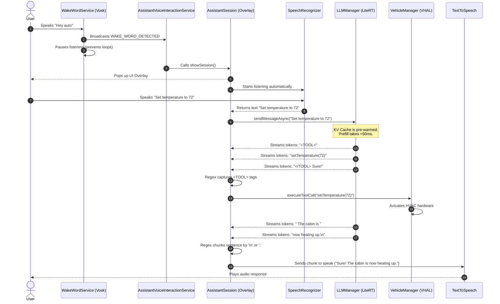

# Automotive AI Assistant Architecture

This document outlines the architecture, components, and data flow of the Android Automotive AI Assistant. The application is designed to provide ultra-low latency, completely offline, LLM-powered voice assistance with deep integration into Android Automotive OS (AAOS) VHAL (Vehicle Hardware Abstraction Layer).

## Core Architecture Overview

The system is built on a split architecture: a primary User Interface (`LocalLLMActivity`) for configuration and extended interactions, and a lightweight System UI Overlay (`AssistantSession`) for persistent, system-wide access. Both rely on a shared Singleton inference engine (`LLMManager`) to ensure rapid response times and consistent state.

### High-Level Component Diagram

```mermaid
graph TD
    A[Microphone] -->|Continuous Audio| B(WakeWordService\nVosk Offline STT)
    B -->|Broadcast 'WAKE_WORD_DETECTED'| C(AssistantVoiceInteractionService)
    C -->|Trigger showSession()| D(AssistantSession\nSystem UI Overlay)
    A -->|On-Demand Audio| D
    
    A -->|On-Demand Audio| E(LocalLLMActivity\nMain App UI)
    
    D <-->|Prompt / Streaming Tokens| F{LLMManager\nSingleton Inference Engine}
    E <-->|Prompt / Streaming Tokens| F
    
    F -->|Model Initialization & Warmup| G[(LiteRT / TensorFlow Lite)]
    
    D -->|Parsed <TOOL> Tags| H(VehicleManager)
    E -->|Parsed <TOOL> Tags| H
    
    H -->|CarPropertyManager| I[AAOS VHAL\nHardware Actuation]
    
    D -->|Streaming Chunks| J(TextToSpeech TTS)
    E -->|Streaming Chunks| J
```

## Main Components & Classes

### 1. `LLMManager.kt` (Singleton Inference Engine)
The heart of the AI processing. It encapsulates the Google LiteRT (TensorFlow Lite) engine.
*   **Role**: Handles model loading from disk, fallback mechanisms (GPU -> CPU), and token streaming.
*   **Optimization**: Features a `warmUpSystemPrompt()` method that runs immediately upon initialization. It pre-computes the massive 1,000+ token System Prompt into the KV Cache in the background, eliminating the "first-time prefill" latency when the user issues their first command.
*   **State Management**: Maintains the `conversation` context so that both the Main App and the System UI overlay share the same KV Cache state.

### 2. `LocalLLMActivity.kt` (Main Application UI)
A traditional Android Activity serving as the comprehensive dashboard.
*   **Role**: Allows users to load specific `.bin`/`.task` models, toggle the wake word, configure system prompts, and interact via a standard chat interface.
*   **Features**: Manages SharedPreferences to ensure settings (like the Wake Word toggle state) persist across app updates and automotive reboots.

### 3. `WakeWordService.kt` (Continuous Background Listener)
A highly optimized Android Foreground Service (Type: Microphone).
*   **Role**: Runs continuously in the background, analyzing microphone input purely offline.
*   **Library**: Utilizes the **Vosk API** (`com.alphacephei:vosk-android`) to provide highly accurate, offline acoustic model matching without requiring Google Cloud or network access.
*   **Trigger**: When it detects the configured wake word (e.g., "hey auto"), it broadcasts an internal intent `com.example.gemininano.WAKE_WORD_DETECTED`.

### 4. `AssistantVoiceInteractionService.kt` & `AssistantSession.kt` (System UI Overlay)
Implements Android's `VoiceInteractionService` API to act as the default device assistant.
*   **Role (`AssistantVoiceInteractionService`)**: A headless service that listens for the WakeWord broadcast and forcefully triggers the assistant overlay via `showSession()`.
*   **Role (`AssistantSession`)**: The actual UI (glassmorphism overlay) that pops up over any app (e.g., Maps, Spotify).
*   **Features**: Uses aggressive `SpeechRecognizer` settings (omitting `EXTRA_PARTIAL_RESULTS`) to ensure instant trailing silence detection. It streams tokens directly from `LLMManager`, executes parsed tools, and streams chunked audio to TTS.

### 5. `VehicleManager.kt` (VHAL Integration)
The bridge between the LLM's generated text and the car's physical hardware.
*   **Role**: Connects to the AAOS `CarPropertyManager`.
*   **Execution**: When the LLM outputs a tag like `<TOOL>setTemperature(72)</TOOL>`, the UI strips it from the display text and forwards it to `VehicleManager`, which synchronously injects the command into the car's CAN bus/VHAL.

## Tool Command Parsing & Navigation Logic
The application employs a regex-based stream interception mechanism to handle tool calls dynamically as the LLM generates tokens, without waiting for the full response to finish.

1.  **System Prompt Instruction**: The LLM is instructed via its system prompt to wrap any hardware commands in XML-like tags, for example: `<TOOL>setTemperature(72)</TOOL>`.
2.  **Stream Interception**: As tokens stream into the `onMessage` callback from LiteRT, the UI appends them to a `lastResponseBuilder`.
3.  **Regex Matching**: On every new token chunk, the app runs the regex `<TOOL>(.*?)</TOOL>` against the accumulated string.
4.  **Execution & UI Stripping**: If a match is found:
    *   The command string (e.g., `setTemperature(72)`) is extracted and passed to `VehicleManager.kt`.
    *   The `VehicleManager` parses the command name and arguments, mapping them directly to `CarPropertyManager` properties (like `VehiclePropertyIds.HVAC_TEMPERATURE_SET`).
    *   The `<TOOL>...</TOOL>` block is immediately replaced with an empty string in the display buffer, ensuring the user never sees the raw code on the screen.
5.  **Deduplication**: A `Set` tracks executed commands to prevent the same tool call from firing multiple times during the streaming process.

## Speech and Audio Engines

To provide a seamless, automotive-grade voice experience, the application splits audio responsibilities across distinct engines based on the specific lifecycle of the interaction.

### 1. Wake Word STT Engine: Vosk API (Offline)
*   **Purpose**: Continuous, passive background listening for the "hey auto" trigger.
*   **Why Vosk?**: Android's built-in `SpeechRecognizer` emits an invasive "beep" sound every time it starts listening, which makes it unusable for silent, continuous background monitoring. Vosk (`com.alphacephei:vosk-android`) uses a lightweight acoustic model (under 50MB) loaded into RAM that runs entirely offline. It processes audio directly from the microphone buffer via `AudioRecord`, avoiding all system-level UI interruptions.

### 2. Active Command STT Engine: Android SpeechRecognizer
*   **Purpose**: High-fidelity transcription of the user's actual command once the assistant overlay is visible.
*   **Why Android API?**: Once the overlay (`AssistantSession`) pops up, the app switches to the system's native `SpeechRecognizer` (`android.speech.SpeechRecognizer`). This engine is highly optimized for complex sentences and intent parsing.
*   **Optimization**: The app explicitly omits the `EXTRA_PARTIAL_RESULTS` flag from the intent. This forces the STT engine to trigger its "end of speech" callback immediately upon trailing silence, cutting out artificial timeout delays and passing the text to the LLM instantly.

### 3. Text-to-Speech (TTS) Engine: Android Native TTS
*   **Purpose**: Speaking the AI's generated response back to the driver.
*   **Streaming Implementation**: The LLM output is streamed, but TTS engines cannot speak half a word. The application uses a custom regex sentence boundary chunker (`"^(.*?)([.!?]+(?:\\s+|$)|\\n)".toRegex()`). 
*   **Behavior**: As tokens arrive, the regex looks for punctuation (`.`, `!`, `?`) or newlines (`\n`). When a complete sentence or list item is formed, it is sliced off and pushed to the TTS `QUEUE_ADD` buffer. This allows the car to start speaking the first sentence while the LLM is still generating the second sentence, significantly reducing perceived latency.

## Sequence Diagram: Wake Word to Hardware Actuation

The following sequence details the ultra-low latency loop from the moment the user speaks the wake word to the moment the hardware reacts.



## Third-Party Libraries

*   **LiteRT (TensorFlow Lite)**: Google's edge inference engine. Enables running multi-billion parameter quantized models (Gemma, Qwen) directly on the automotive Snapdragon SOC without internet access.
*   **Vosk API**: Provides offline, silent speech recognition for continuous background wake-word listening.
