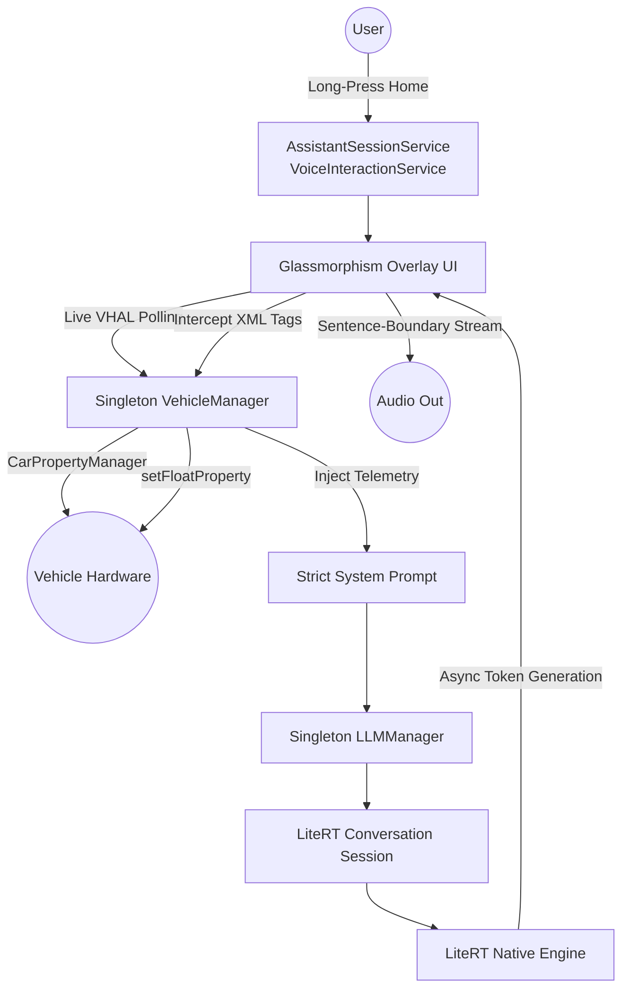

# Android Automotive Local AI Assistant Architecture

The application is built directly on the **LiteRT (formerly TensorFlow Lite) Native API** (`com.google.ai.edge.litertlm`), providing lower-level, high-performance access to the inference engine and conversation context management compared to higher-level SDKs like MediaPipe.

## Key Components
- **VehicleManager**: A singleton bridging the Android Automotive `CarPropertyManager` to read/write real-world hardware sensors securely.
- **LLMManager**: A singleton orchestrating the `Engine` and `Conversation` objects from the LiteRT library, managing the strict KV Cache bounds (e.g., 512-token auto-flush) and maintaining the model resident in RAM.
- **AssistantSession**: The core overlay popup that handles chat input, prompt strictness, XML tag parsing, and TTS playback.

## Intent Recognition & Eager Streaming Execution (Sub-2s Latency)
Unlike cloud-based LLMs that use JSON schema-based function calling, this offline architecture leverages **In-Context Learning and Eager XML Tag Streaming** to execute tools instantly.

1. **Strict Context Inject:** `LLMManager` injects live VHAL data and a strict list of allowed tools into the System Prompt.
2. **Tool-First Generation:** The AI is strictly prompted to output the action tag **first** before generating conversational text (e.g., `<TOOL>increaseTemperature(5)</TOOL> I will warm it up.`).
3. **Eager Interception (Streaming):** `AssistantSession` (or `LocalLLMActivity`) does not wait for the generation to finish. It scans the asynchronous token stream in the `onMessage()` callback.
4. **Instant Execution:** The millisecond a valid tag is detected, the UI layer extracts the argument, strips the XML from the user-facing UI to prevent flickering, and instantly invokes the physical hardware setter via `VehicleManager`.

### Example Use-Case: "I am freezing"
When a user says *"I am freezing"*, the AI achieves a sub-2-second Time-To-First-Action:
- **Reasoning:** The model understands that the user is cold, and the current temperature is only 65F. 
- **Tool-First Output:** The model immediately generates `<TOOL>increaseTemperature(5)</TOOL>` within the first few tokens (under 1.5 seconds).
- **Execution:** The streaming parser intercepts the tag, silently hides it from the UI, and calls `VehicleManager.writeTemperatureToVhal()`. The HVAC physically starts blowing warmer air.
- **Conversational Continuation:** The AI continues streaming *"I will turn up the heat for you."* to the screen and Text-To-Speech engine without blocking the physical vehicle action.

## Streaming Text-To-Speech (Sentence-Boundary Execution)
To prevent the voice interface from feeling laggy, the app uses **Sentence-Boundary Streaming TTS**. 

1. **Buffer Monitoring:** As tokens generate, the system buffers the incoming text and uses Regex (`[.!?\n]`) to detect completed sentences.
2. **Queue Injection:** The moment a sentence is detected, it is extracted and sent to the TTS engine with `QUEUE_ADD`. The AI speaks the first sentence while calculating the next ones.
3. **Silent Synchronization Trigger:** The app queues a `10ms` silent track at the end of the TTS stream during `onDone()`. The `UtteranceProgressListener` waits until the voice engine hits this silent track before re-opening the microphone or closing the app, ensuring the microphone isn't turned on prematurely while the voice is still speaking queued sentences.
