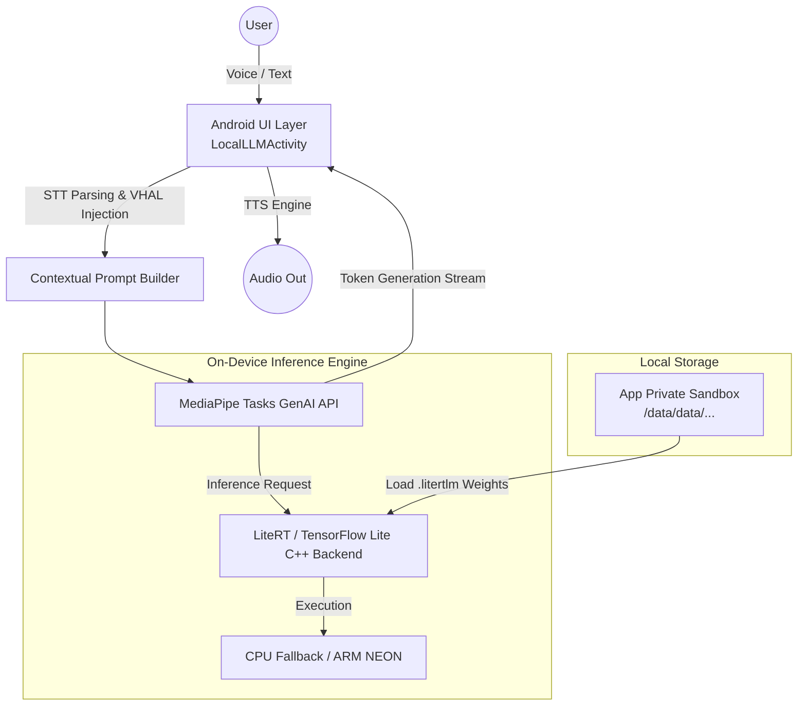

# Android Automotive Local LLM Sample

This project is a fully functional Android application demonstrating on-device Large Language Model (LLM) inference using Google's **MediaPipe Tasks GenAI** library. It is designed and tested within an AOSP (Android Automotive) environment on a Google Pixel Tablet.

## Features

- **100% On-Device Inference**: No cloud API keys required. All text generation happens locally on the device's CPU/GPU.
- **Interactive Voice Assistant**: Fully integrated Speech-to-Text (STT) and Text-to-Speech (TTS). Talk to the LLM naturally, and it speaks back!
- **Context-Aware Vehicle State**: Injects simulated hardware state (Speed, Cabin Temp, Fuel Level, Ambient Lighting) into the prompt so the LLM responds accurately as the vehicle.
- **8 Premium Cabin Experiences**: Includes one-tap scenarios for Diagnostics, Navigation, Media Control, and Digital Owner's Manuals.
- **Professional Chat UI**: Modern messaging layout built with RecyclerView and Glassmorphism styling.
- **Multiple Model Support**: Includes a dynamic dropdown to switch between supported LiteRT models (SmolLM, Gemma, Qwen, etc.).

---

## Architecture

The application is built on top of MediaPipe's cross-platform GenAI SDK, which leverages LiteRT (formerly TensorFlow Lite) to run quantized model weights natively on the device hardware.



### Key Components
- **LocalLLMActivity**: The primary Kotlin activity managing the UI, Voice, and the `ListenableFuture` for generation.
- **ChatAdapter**: Manages the RecyclerView for rendering dynamic User vs Model chat bubbles.
- **MediaPipe LlmInference**: The core Java/JNI wrapper that abstracts away TFLite session management.

---

## Supported Models & AAOS Hardware Contexts

Because Android Automotive OS (AAOS) hardware varies significantly, this application supports models optimized for different computational tiers. All models are sourced from the [HuggingFace litert-community](https://huggingface.co/litert-community).

- **Entry-Level**: `SmolLM-135M-Instruct.task` (150MB)
- **Mid-Range**: `Qwen2.5-1.5B-Instruct.litertlm` (1.6GB), `gemma-4-E2B-it.litertlm` (2.5GB)
- **Premium**: `Phi-4-mini-instruct.litertlm` (3.8GB)

---

## Executing on Custom Hardware (Manual Deployment)

To deploy this application on a physical development board, a head unit, or another Android tablet, follow these exact steps to compile, install, and securely load the models.

### Step 1: Clone & Compile
Ensure you have the Android SDK installed, or use the provided Gradle wrapper.
```bash
# Clean and assemble the Debug APK
./gradlew clean assembleDebug
```

### Step 2: Install the Application
Connect to your hardware via ADB and install the generated APK.
```bash
adb install -r app/build/outputs/apk/debug/app-debug.apk
```

### Step 3: Push the LLM Model Safely
Android 14 imposes strict SELinux rules on internal app storage. To bypass permission denials, this application has been upgraded to read from the FUSE-backed **External App-Specific Directory** (`/sdcard/Android/data/com.example.gemininano/files/`).

You can use the automated script:
```bash
./setup_model.sh
```

**Manual Alternative (Multi-User Android Automotive)**:
In Android Automotive, the active driver is often assigned **User ID 10** instead of 0. If you prefer manual commands, ensure you push as root to the correct User ID space to bypass FUSE permission issues:

```bash
adb root
adb shell mkdir -p /data/media/10/Android/data/com.example.gemininano/files/
adb push gemma-2b-it-gpu-int4.bin /data/media/10/Android/data/com.example.gemininano/files/
```

### Step 4: Launch and Test
Launch the app via ADB or from the app drawer:
```bash
adb shell am start -n com.example.gemininano/.LocalLLMActivity
```
1. Accept the Microphone Permissions prompt.
2. The **Dynamic Fallback Scanner** will automatically detect any `.bin`, `.task`, or `.litertlm` file you pushed and switch the UI dropdown to match it!
3. Verify it says **"Model found locally!"**
4. Click **Load Model**, wait for initialization, and press the **🎤 Voice** button to test!

---

## Porting to Another Platform

Because this app is built on top of **MediaPipe**, the core LLM inference logic and the model files (`.litertlm`, `.task`) are completely cross-platform.

### 1. Porting to Standard Android (Phones/Tablets)
This codebase is already fully compatible with standard Android OS. Simply compile and deploy the APK. 

### 2. Porting to iOS
- Add the `MediaPipeTasksGenAI` CocoaPod to your Xcode project.
- Copy the exact same `.litertlm` model files into your Xcode project bundle.
- Rebuild the UI using Swift/SwiftUI. Use the Swift `LlmInference(options:)` API.

### 3. Porting to Web (Browser)
- Install the `@mediapipe/tasks-genai` NPM package.
- Host the `.litertlm` models on a web server/CDN.
- Pass the URL to the `FilesetResolver` and utilize WebGL/WebGPU for acceleration.
