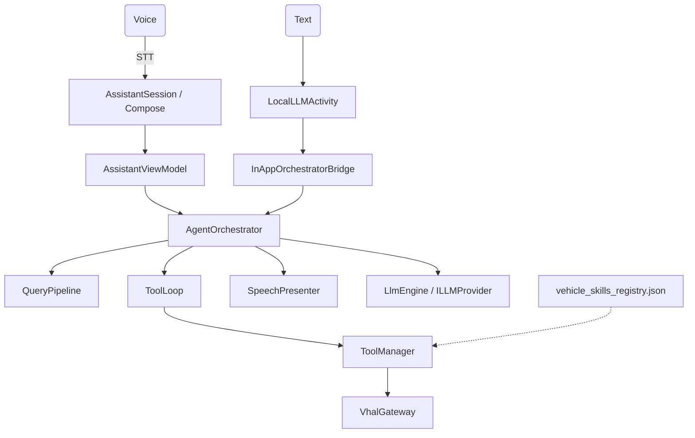

# Android Automotive Local AI Assistant

This project is a system-level Android Automotive (AAOS) digital assistant with **on-device LiteRT LLM inference**, VoiceInteraction overlay UI, and native VHAL tool control. It is designed for a warm resident agent process — not a cloud-only chatbot.

## Features

- **System-Level Digital Assistant**: Registers as a native `VoiceInteractionService`. Set it as your default assistant to summon the immersive Compose overlay (or legacy XML layouts) from any app.
- **Hybrid AI Engine**: Prefer on-device LiteRT models (SmolLM, Gemma, Qwen, Phi, …) with optional cloud fallback (Gemini / Claude) via `AssistantFeatureFlags` routing.
- **Native VHAL Integration (Read/Write)**: Wired into `CarPropertyManager` through a `VhalGateway` port — live telemetry for prompt context and real HVAC/media/window actuation.
- **Architecture (V2)**:
  - 🛡️ **Native Security Guardrails**: High-risk vehicle commands require explicit confirmation before execution.
  - 🔑 **Keyword tool routing**: Skills registry matching (aliases + keywords). Semantic embedder RAG is **disabled** by default to avoid MediaPipe JNI clashes — miss returns empty, never dumps the full registry.
  - 💾 **Sliding-window memory**: `ConversationMemory` port keeps edge/cloud context bounded.
  - ⚙️ **Eager tools + sentence TTS**: Complete `</TOOL>` tags run mid-stream; TTS speaks at sentence boundaries for lower time-to-first-audio.
  - 📱 **Visual Feedback**: Compose face/mood chrome plus optional native overlays for vehicle actions.
- **Voice Interactions (STT & TTS)**: Vosk wake word → Android `SpeechRecognizer` command STT → Android TTS (single-owner mic arm path).
- **Multiple Model Support**: Dynamic fallback scanner loads supported LiteRT models from external storage.

---

## Architecture

Layered agent: thin UI → ViewModel → domain UseCases / orchestrator pipeline → ports (LLM, VHAL, memory, audio) owned by `VehicleAgentService`.

See [ARCHITECTURE.md](ARCHITECTURE.md) and [docs/architecture/decoupling_roadmap.md](docs/architecture/decoupling_roadmap.md).



For **Eager Streaming Tool Execution** and **Sentence-Boundary Streaming TTS**, see the Architecture Documentation.

---

## Adding New Hardware Features (Zero-Code Architecture)

This project uses a highly scalable, JSON-driven tool architecture. You can add support for new Android Automotive VHAL properties or fix existing ones without writing any Kotlin code.

All mappings are located in a single file: `app/src/main/assets/vehicle_skills_registry.json`

This JSON file contains two arrays:
- `"properties"`: Sensors the AI reads to understand the car's state (e.g., Battery, Tire Pressure).
- `"tools"`: Actions the AI can take to physically control the car (e.g., HVAC, Windows, Trunk).

> **📖 Complete Reference Guide:** For a deep-dive tutorial on mapping complex custom Kotlin actions, adding safety guardrails, and enforcing high-risk confirmation dialogues, please read the full **[Vehicle Skills Registry Guide](docs/VEHICLE_SKILLS_REGISTRY_GUIDE.md)**.

### 1. How to Fix an Existing Tool or Property
If a tool like `<TOOL>openTrunk()</TOOL>` isn't working on your specific car/emulator, it means the `property_id` in the JSON doesn't match your car's hardware.
1. Connect via ADB and run: `adb shell dumpsys car_service --hal`
2. Search the output for the feature you want (e.g., `Property: 0x16200b02 (DOOR_LOCK)`).
3. Convert the Hex ID (`0x16200b02`) to a Decimal integer (`371198722`).
4. Open `vehicle_skills_registry.json`, find the tool block (e.g., `"handler_key": "unlockDoors"`), and update the `"property_id"` field to your new decimal integer.

### 2. How to Add a Completely New Tool (Generic VHAL Write)
To allow the LLM to physically control a brand new vehicle feature (e.g., Ambient Lights):
1. Find the property ID for Ambient Lights using the `dumpsys` command above.
2. Open `vehicle_skills_registry.json` and append a new block to the `"tools"` array.
3. Use `"handler_type": "GENERIC_VHAL_WRITE"` so the system handles it automatically.

**Required fields for a new tool:**
```json
{
  "prompt_string": "<TOOL>setAmbientLight()</TOOL>", // The exact syntax the AI must output
  "handler_type": "GENERIC_VHAL_WRITE", // Tells the engine no Kotlin code is needed
  "property_id": 356518835, // The decimal ID for the VHAL property
  "data_type": "INT", // "INT", "FLOAT", "BOOLEAN", or "STRING"
  "area_id": 0, // 0 usually means global/all areas
  "value_to_write": "5", // The value to write to the VHAL when this tool is called
  "success_message": "I've changed the ambient lighting color.", // What the car speaks out loud
  "keywords": ["ambient", "light", "color", "mood", "lighting"] // Used for semantic routing
}
```

### 3. Adding Complex Commands (Custom Kotlin)
If a command requires complex math, area ID iteration, or safety guardrails (e.g., speed limits for windows), use `"handler_type": "CUSTOM_KOTLIN"` and map it to a `"handler_key"`. Then, write the custom execution logic in `ToolManager.kt`.

---

## Supported Models & AAOS Hardware Contexts

Because Android Automotive OS (AAOS) hardware varies significantly, this application supports models optimized for different computational tiers. All models are sourced from the [HuggingFace litert-community](https://huggingface.co/litert-community) and can be downloaded directly **without any login required**.

- **Entry-Level**: `SmolLM-135M-Instruct` (150MB)
  - `wget https://huggingface.co/litert-community/SmolLM-135M-Instruct/resolve/main/SmolLM-135M-Instruct_multi-prefill-seq_q8_ekv1280.task -O SmolLM-135M-Instruct.task`
- **Mid-Range**: `Qwen2.5-1.5B-Instruct` (1.6GB, **Supports 4K Context**)
  - `wget https://huggingface.co/litert-community/Qwen2.5-1.5B-Instruct/resolve/main/Qwen2.5-1.5B-Instruct_multi-prefill-seq_q8_ekv4096.litertlm -O Qwen2.5-1.5B-Instruct.litertlm`
- **Mid-Range / Premium**: `Gemma-4-E2B-IT` (2.5GB)
  - Generic Android:
    - `wget https://huggingface.co/litert-community/gemma-4-E2B-it-litert-lm/resolve/main/gemma-4-E2B-it.litertlm -O gemma-4-E2B-it.litertlm`
  - Qualcomm SA8255/SA8275 (Highly Optimized for Hexagon NPU):
    - `wget https://huggingface.co/litert-community/gemma-4-E2B-it-litert-lm/resolve/main/gemma-4-E2B-it_qualcomm_qcs8275.litertlm -O gemma-4-E2B-it_qualcomm_qcs8275.litertlm`
  - *(Ensure you select the exact matching model name in the app UI after pushing via ADB)*
- **Premium** (Best for SA8295 / Tensor G2):
  - `Gemma-2B-IT GPU INT4` (2.5GB):
    - `wget https://storage.googleapis.com/mediapipe-models/llm/gemma-2b-it-gpu-int4.bin -O gemma-2b-it-gpu-int4.bin`
  - `Llama-3.2-3B-Instruct` (3.2GB, **Gated Model - Requires HF Token**):
    - *Note: Meta requires you to accept the license on HuggingFace first. You must pass your token to download.*
    - `wget --header="Authorization: Bearer YOUR_HF_TOKEN" https://huggingface.co/litert-community/Llama-3.2-3B-Instruct/resolve/main/Llama-3.2-3B-Instruct_multi-prefill-seq_q8_ekv4096.litertlm -O Llama-3.2-3B-Instruct.litertlm`
  - `Qwen2.5-3B-Instruct` (3.1GB):
    - `wget https://huggingface.co/litert-community/Qwen2.5-3B-Instruct/resolve/main/Qwen2.5-3B-Instruct_multi-prefill-seq_q8_ekv4096.litertlm -O Qwen2.5-3B-Instruct.litertlm`

### Cloud API Models
If you prefer to leverage massive cloud models for advanced capabilities while still retaining the exact same in-vehicle tool execution pipeline, you can select these models directly from the debug UI:
- **Google Gemini 2.5 Flash**: Lightning-fast reasoning and broad world knowledge.
- **Anthropic Claude 3.5 Sonnet**: Industry-leading intelligence and conversational prowess.
> **Note:** To use cloud models, simply select them from the UI dropdown and paste your respective API Key into the dynamically generated text box. Keys are securely saved locally via `SharedPreferences`.

---

## Executing on Custom Hardware (Manual Deployment)

To deploy this application on a physical development board, a head unit, or another Android tablet, follow these exact steps to compile, install, and securely load the models.

### Step 1: Clone & Compile
Ensure you have the Android SDK installed, or use the provided Gradle wrapper.
```bash
# Clean and assemble the Debug APK
./gradlew clean assembleDebug
```

### Step 2: Deploy as Privileged System App (Required for HVAC/Time Control)
Because the app requires `android.car.permission.CONTROL_CAR_CLIMATE` and `android.permission.SET_TIME`, it must be installed as a Privileged System App on new hardware.

Connect to your hardware via ADB and execute the following to push the APK and pre-grant permissions:
```bash
adb root
adb remount

# Push the permission whitelist XML
adb push privapp-permissions-com.tcs.vehicleassistant.xml /etc/permissions/

# Create the directory and push the APK
adb shell mkdir -p /system/priv-app/GeminiNano
adb push app/build/outputs/apk/debug/app-debug.apk /system/priv-app/GeminiNano/

# Reboot the system to apply privileged status
adb reboot
```
*(If you do not need HVAC controls and just want to test chat, you can simply run `adb install -r -g app/build/outputs/apk/debug/app-debug.apk` to install with pre-granted standard permissions.)*

### Step 3: Push the LLM Model Safely
Android 14 imposes strict SELinux rules on internal app storage. To bypass permission denials, this application has been upgraded to read from the FUSE-backed **External App-Specific Directory** (`/sdcard/Android/data/com.tcs.vehicleassistant/files/`).

You can use the automated script:
```bash
./setup_model.sh
```

**Manual Alternative (Multi-User Android Automotive)**:
In Android Automotive, the active driver is often assigned **User ID 10** instead of 0. If you prefer manual commands, ensure you push as root to the correct User ID space to bypass FUSE permission issues:

> **IMPORTANT**: NEVER commit these massive 2GB+ model files to GitHub, or your push will be permanently rejected! ONLY push them directly to your hardware using ADB.

```bash
adb root
adb shell mkdir -p /data/media/10/Android/data/com.tcs.vehicleassistant/files/
# Example for pushing Qwen 2.5:
adb push Qwen2.5-1.5B-Instruct.litertlm /data/media/10/Android/data/com.tcs.vehicleassistant/files/
# Example for pushing Gemma 4 E2B (Qualcomm SA8255):
adb push gemma-4-E2B-it_qualcomm_qcs8275.litertlm /data/media/10/Android/data/com.tcs.vehicleassistant/files/
```

### Step 4: Configuration & Usage
1. Open the **Local AI Assistant** app manually from the launcher.
2. Grant the required Microphone and Automotive Permissions.
3. Tap **Load Model** to initialize the AI engine into memory.
4. Navigate to **Android Settings -> Apps -> Default Apps -> Digital assistant app** and set it to **Local AI Assistant**.
5. Long-press the home button to invoke the overlay and say *"Turn up the heat!"*.

### Troubleshooting
**Q: The Assistant fails to initialize or doesn't work when the internet is completely offline on the dev board.**
A: In some AOSP builds, if the system time is completely unsynchronized (e.g., defaulted to 1970) due to a lack of NTP sync on an offline board, SSL certificates for the Cloud fallback check or the underlying SpeechRecognizer/LiteRT engine may fail to initialize. 
**Fix:** Manually correct the system date and time via Android Settings, or push it via ADB:
`adb shell date $(date +%m%d%H%M%Y.%S)`
