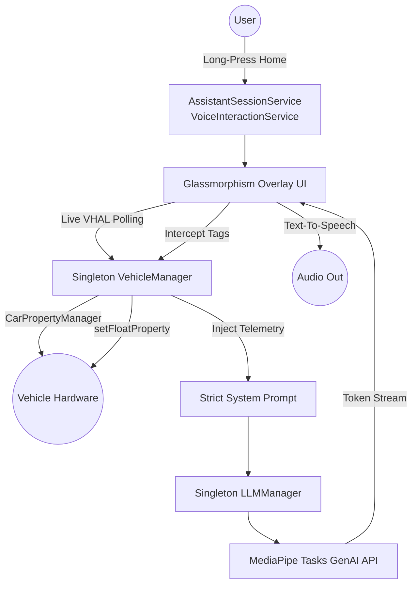

# Android Automotive Local AI Assistant

This project is a fully functional, system-level Android Digital Assistant demonstrating on-device Large Language Model (LLM) inference using Google's **MediaPipe Tasks GenAI** library. It is designed and tested within an AOSP (Android Automotive) environment on a Google Pixel Tablet.

## Features

- **System-Level Digital Assistant**: Registers as a native `VoiceInteractionService`. Set it as your default assistant to summon a modern, glassmorphism overlay popup from any app using the home button.
- **100% On-Device Inference**: No cloud API keys required. All text generation happens locally on the device's CPU/GPU via a persistent, singleton background engine.
- **Native VHAL Integration (Read/Write)**: The AI is directly wired into the `CarPropertyManager`. It reads live telemetry (`PERF_VEHICLE_SPEED`, `HVAC_TEMPERATURE_SET`) for prompt context, and can physically alter the vehicle's HVAC system in real-time by intercepting `<TEMP_UP>`/`<TEMP_DOWN>` tags.
- **Strict Prompt Engineering**: The underlying model is strictly constrained to provide concise, direct, sub-15-word answers with zero hallucination.
- **Voice Interactions (STT & TTS)**: Fully integrated Speech-to-Text and Android Text-to-Speech (TTS). Talk to the Assistant naturally, and it will speak its precise confirmations aloud.
- **Multiple Model Support**: Includes a dynamic fallback scanner to load any supported LiteRT model (SmolLM, Gemma, Qwen, Phi) placed in the external storage directory.

---

## Architecture

The application is built on top of MediaPipe's cross-platform GenAI SDK, which leverages LiteRT (formerly TensorFlow Lite) to run quantized model weights natively on the device hardware.



### Key Components
- **VehicleManager**: A singleton bridging the Android Automotive `CarPropertyManager` to read/write real-world hardware sensors securely.
- **LLMManager**: A singleton ensuring the multi-gigabyte LLM stays resident in RAM while the UI is dismissed.
- **AssistantSession**: The core overlay popup that handles chat input, prompt strictness, tag parsing, and TTS playback.

---

## Supported Models & AAOS Hardware Contexts

Because Android Automotive OS (AAOS) hardware varies significantly, this application supports models optimized for different computational tiers. All models are sourced from the [HuggingFace litert-community](https://huggingface.co/litert-community) and can be downloaded directly **without any login required**.

- **Entry-Level**: `SmolLM-135M-Instruct.task` (150MB)
  - `wget https://huggingface.co/litert-community/SmolLM-135M-Instruct/resolve/main/SmolLM-135M-Instruct_multi-prefill-seq_q8_ekv1280.task -O SmolLM-135M-Instruct.task`
- **Mid-Range**: `Qwen2.5-1.5B-Instruct.litertlm` (1.6GB)
  - `wget https://huggingface.co/litert-community/Qwen2.5-1.5B-Instruct/resolve/main/Qwen2.5-1.5B-Instruct_multi-prefill-seq_q8_ekv4096.litertlm -O Qwen2.5-1.5B-Instruct.litertlm`
- **Mid-Range**: `gemma-4-E2B-it.litertlm` (2.5GB)
  - `wget https://huggingface.co/litert-community/gemma-4-E2B-it-litert-lm/resolve/main/gemma-4-E2B-it.litertlm -O gemma-4-E2B-it.litertlm`
- **Premium**: `Phi-4-mini-instruct.litertlm` (3.8GB)
  - `wget https://huggingface.co/litert-community/Phi-4-mini-instruct/resolve/main/Phi-4-mini-instruct_multi-prefill-seq_q8_ekv4096.litertlm -O Phi-4-mini-instruct.litertlm`

---

## Executing on Custom Hardware (Manual Deployment)

To deploy this application on a physical development board, a head unit, or another Android tablet, follow these exact steps to compile, install, and securely load the models.

### Step 1: Clone & Compile
Ensure you have the Android SDK installed, or use the provided Gradle wrapper.
```bash
# Clean and assemble the Debug APK
./gradlew clean assembleDebug
```

### Step 2: Install the Application
Connect to your hardware via ADB and install the generated APK.
```bash
adb install -r app/build/outputs/apk/debug/app-debug.apk
```

### Step 3: Push the LLM Model Safely
Android 14 imposes strict SELinux rules on internal app storage. To bypass permission denials, this application has been upgraded to read from the FUSE-backed **External App-Specific Directory** (`/sdcard/Android/data/com.example.gemininano/files/`).

You can use the automated script:
```bash
./setup_model.sh
```

**Manual Alternative (Multi-User Android Automotive)**:
In Android Automotive, the active driver is often assigned **User ID 10** instead of 0. If you prefer manual commands, ensure you push as root to the correct User ID space to bypass FUSE permission issues:

```bash
adb root
adb shell mkdir -p /data/media/10/Android/data/com.example.gemininano/files/
adb push Qwen2.5-1.5B-Instruct.litertlm /data/media/10/Android/data/com.example.gemininano/files/
```

### Step 4: Configuration & Usage
1. Open the **Local AI Assistant** app manually from the launcher.
2. Grant the required Microphone and Automotive Permissions.
3. Tap **Load Model** to initialize the AI engine into memory.
4. Navigate to **Android Settings -> Apps -> Default Apps -> Digital assistant app** and set it to **Local AI Assistant**.
5. Long-press the home button to invoke the overlay and say *"Turn up the heat!"*.
