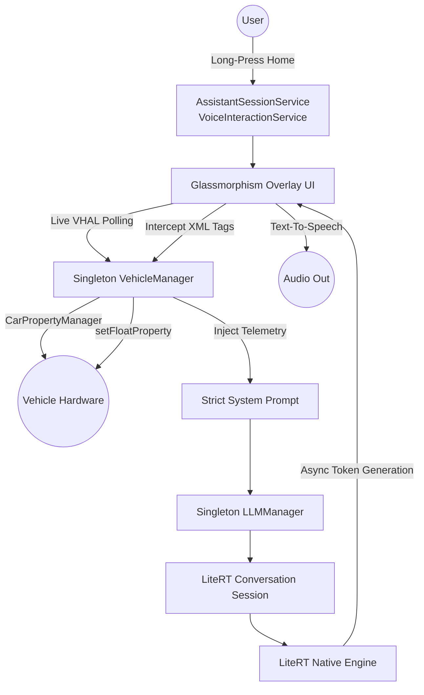

# Android Automotive Local AI Assistant

This project is a fully functional, system-level Android Digital Assistant demonstrating on-device Large Language Model (LLM) inference using Google's **MediaPipe Tasks GenAI** library. It is designed and tested within an AOSP (Android Automotive) environment on a Google Pixel Tablet.

## Features

- **System-Level Digital Assistant**: Registers as a native `VoiceInteractionService`. Set it as your default assistant to summon a modern, glassmorphism overlay popup from any app using the home button.
- **100% On-Device Inference**: No cloud API keys required. All text generation happens locally on the device's CPU/GPU via a persistent, singleton background engine.
- **Native VHAL Integration (Read/Write)**: The AI is directly wired into the `CarPropertyManager`. It reads live telemetry (`PERF_VEHICLE_SPEED`, `HVAC_TEMPERATURE_SET`) for prompt context, and can physically alter the vehicle's HVAC system in real-time by intercepting `<TEMP_UP>`/`<TEMP_DOWN>` tags.
- **Strict Prompt Engineering**: The underlying model is strictly constrained to provide concise, direct, sub-15-word answers with zero hallucination.
- **Voice Interactions (STT & TTS)**: Fully integrated Speech-to-Text and Android Text-to-Speech (TTS). Talk to the Assistant naturally, and it will speak its precise confirmations aloud.
- **Multiple Model Support**: Includes a dynamic fallback scanner to load any supported LiteRT model (SmolLM, Gemma, Qwen, Phi) placed in the external storage directory.

---

## Architecture

The application is built directly on the **LiteRT (formerly TensorFlow Lite) Native API** (`com.google.ai.edge.litertlm`), providing lower-level, high-performance access to the inference engine and conversation context management compared to higher-level SDKs like MediaPipe.



### Key Components
- **VehicleManager**: A singleton bridging the Android Automotive `CarPropertyManager` to read/write real-world hardware sensors securely.
- **LLMManager**: A singleton orchestrating the `Engine` and `Conversation` objects from the LiteRT library, managing the strict KV Cache bounds (e.g., 512-token auto-flush) and maintaining the model resident in RAM.
- **AssistantSession**: The core overlay popup that handles chat input, prompt strictness, XML tag parsing, and TTS playback.

### Intent Recognition & Eager Streaming Execution (Sub-2s Latency)
Unlike cloud-based LLMs that use JSON schema-based function calling, this offline architecture leverages **In-Context Learning and Eager XML Tag Streaming** to execute tools instantly.

1. **Strict Context Inject:** `LLMManager` injects live VHAL data and a strict list of allowed tools into the System Prompt.
2. **Tool-First Generation:** The AI is strictly prompted to output the action tag **first** before generating conversational text (e.g., `<TOOL>increaseTemperature(5)</TOOL> I will warm it up.`).
3. **Eager Interception (Streaming):** `AssistantSession` (or `LocalLLMActivity`) does not wait for the generation to finish. It scans the asynchronous token stream in the `onMessage()` callback.
4. **Instant Execution:** The millisecond a valid tag is detected, the UI layer extracts the argument, strips the XML from the user-facing UI to prevent flickering, and instantly invokes the physical hardware setter via `VehicleManager`.

#### Example Use-Case: "I am freezing"
When a user says *"I am freezing"*, the AI achieves a sub-2-second Time-To-First-Action:
- **Reasoning:** The model understands that the user is cold, and the current temperature is only 65F. 
- **Tool-First Output:** The model immediately generates `<TOOL>increaseTemperature(5)</TOOL>` within the first few tokens (under 1.5 seconds).
- **Execution:** The streaming parser intercepts the tag, silently hides it from the UI, and calls `VehicleManager.writeTemperatureToVhal()`. The HVAC physically starts blowing warmer air.
- **Conversational Continuation:** The AI continues streaming *"I will turn up the heat for you."* to the screen and Text-To-Speech engine without blocking the physical vehicle action.
---

## Supported Models & AAOS Hardware Contexts

Because Android Automotive OS (AAOS) hardware varies significantly, this application supports models optimized for different computational tiers. All models are sourced from the [HuggingFace litert-community](https://huggingface.co/litert-community) and can be downloaded directly **without any login required**.

- **Entry-Level**: `SmolLM-135M-Instruct` (150MB)
  - `wget https://huggingface.co/litert-community/SmolLM-135M-Instruct/resolve/main/SmolLM-135M-Instruct_multi-prefill-seq_q8_ekv1280.task -O SmolLM-135M-Instruct.task`
- **Mid-Range**: `Qwen2.5-1.5B-Instruct` (1.6GB, **Supports 4K Context**)
  - `wget https://huggingface.co/litert-community/Qwen2.5-1.5B-Instruct/resolve/main/Qwen2.5-1.5B-Instruct_multi-prefill-seq_q8_ekv4096.litertlm -O Qwen2.5-1.5B-Instruct.litertlm`
- **Premium**: `Gemma-2B-IT GPU INT4` (2.5GB)
  - `wget https://storage.googleapis.com/mediapipe-models/llm/gemma-2b-it-gpu-int4.bin -O gemma-2b-it-gpu-int4.bin`

---

## Executing on Custom Hardware (Manual Deployment)

To deploy this application on a physical development board, a head unit, or another Android tablet, follow these exact steps to compile, install, and securely load the models.

### Step 1: Clone & Compile
Ensure you have the Android SDK installed, or use the provided Gradle wrapper.
```bash
# Clean and assemble the Debug APK
./gradlew clean assembleDebug
```

### Step 2: Deploy as Privileged System App (Required for HVAC/Time Control)
Because the app requires `android.car.permission.CONTROL_CAR_CLIMATE` and `android.permission.SET_TIME`, it must be installed as a Privileged System App on new hardware.

Connect to your hardware via ADB and execute the following to push the APK and pre-grant permissions:
```bash
adb root
adb remount

# Push the permission whitelist XML
adb push app/src/main/res/xml/privapp-permissions-com.example.gemininano.xml /etc/permissions/

# Create the directory and push the APK
adb shell mkdir -p /system/priv-app/GeminiNano
adb push app/build/outputs/apk/debug/app-debug.apk /system/priv-app/GeminiNano/

# Reboot the system to apply privileged status
adb reboot
```
*(If you do not need HVAC controls and just want to test chat, you can simply run `adb install -r -g app/build/outputs/apk/debug/app-debug.apk` to install with pre-granted standard permissions.)*

### Step 3: Push the LLM Model Safely
Android 14 imposes strict SELinux rules on internal app storage. To bypass permission denials, this application has been upgraded to read from the FUSE-backed **External App-Specific Directory** (`/sdcard/Android/data/com.example.gemininano/files/`).

You can use the automated script:
```bash
./setup_model.sh
```

**Manual Alternative (Multi-User Android Automotive)**:
In Android Automotive, the active driver is often assigned **User ID 10** instead of 0. If you prefer manual commands, ensure you push as root to the correct User ID space to bypass FUSE permission issues:

```bash
adb root
adb shell mkdir -p /data/media/10/Android/data/com.example.gemininano/files/
adb push Qwen2.5-1.5B-Instruct.litertlm /data/media/10/Android/data/com.example.gemininano/files/
```

### Step 4: Configuration & Usage
1. Open the **Local AI Assistant** app manually from the launcher.
2. Grant the required Microphone and Automotive Permissions.
3. Tap **Load Model** to initialize the AI engine into memory.
4. Navigate to **Android Settings -> Apps -> Default Apps -> Digital assistant app** and set it to **Local AI Assistant**.
5. Long-press the home button to invoke the overlay and say *"Turn up the heat!"*.
