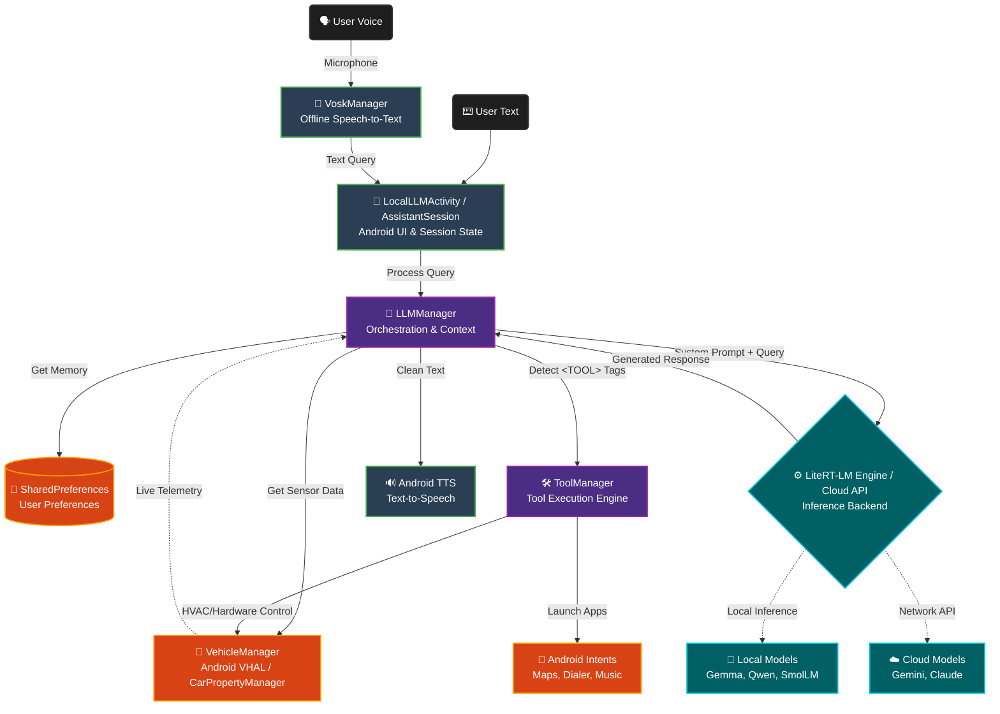

# Local AI Assistant: Architecture Details

This document outlines the internal architecture of the Android Automotive Local AI Assistant. The system is designed to provide ultra-low latency, 100% offline conversational capabilities with direct read/write access to vehicle hardware.

## System Block Diagram

The following diagram illustrates the data flow from user input through the inference engine, and out to the vehicle's hardware actuators and speech interfaces.

## Component Breakdown

### 1. Input Layer
- **VoskManager**: Handles 100% offline Speech-to-Text (STT) conversion. It listens to microphone input when triggered and converts spoken words into a text query, ensuring privacy and zero latency.
- **LocalLLMActivity / AssistantSession**: The primary user interface. It manages the conversational state, displays the animated pulsing UI, and handles user interactions (text or voice).

### 2. Orchestration Layer
- **LLMManager**: The brain of the application. It takes the user's query, fetches live vehicle telemetry from the `VehicleManager`, retrieves user preferences from `SharedPreferences`, and dynamically constructs a massive **System Prompt**. This prompt instructs the AI on current conditions, available tools, and strict formatting rules.

### 3. Hardware / Telemetry Layer
- **VehicleManager**: A critical component that directly binds to the Android Automotive `CarPropertyManager`.
  - **Read**: Subscribes to VHAL (Vehicle Hardware Abstraction Layer) properties like HVAC temperature, door status, gear selection, and fuel level.
  - **Write**: Exposes setter methods to physically change vehicle state (e.g., turning on seat heaters, adjusting AC).

### 4. Inference Engine
- **LiteRT-LM / Cloud API**: The execution environment. 
  - For local execution, it uses the LiteRT-LM (formerly TensorFlow Lite) C++ backend via JNI to run highly optimized `.litertlm` models directly on the device's CPU or GPU. 
  - For cloud execution, it routes the query to Google Gemini or Anthropic Claude APIs using REST.

### 5. Execution Layer
- **ToolManager**: Parses the raw output from the LLM. If it detects the `<TOOL>` syntax (e.g., `<TOOL>setSeatHeater(2)</TOOL>`), it intercepts the command and executes the corresponding native Android function rather than showing the raw tag to the user.
- **Android Intents**: Used by the `ToolManager` to launch external applications like Google Maps for navigation or the Dialer for phone calls.
- **Android TTS**: Cleans the LLM's response (removing tool tags) and reads the conversational reply aloud to the driver.
