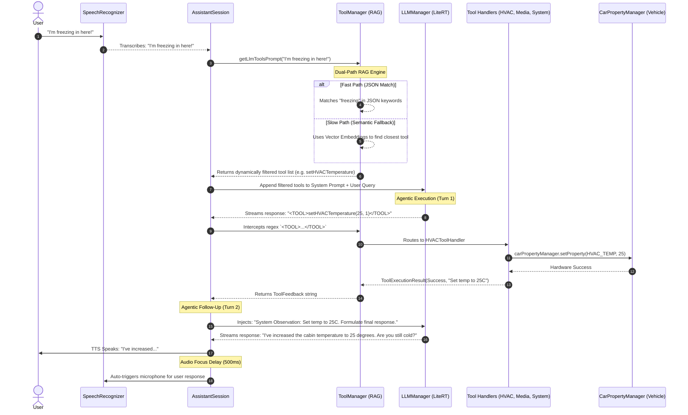

# Agentic Loop & Execution Flow

This document provides a step-by-step breakdown of how the **VehicleEdgeAssistant** processes a natural language command, utilizes tools, and executes hardware actions through its autonomous Agentic Loop.

## 1. High-Level Sequence Diagram

The following sequence diagram maps out the complete multi-turn interaction cycle from the moment the user speaks to the moment the vehicle actuates hardware and responds.



## 2. Deep Dive: RAG Preparation & JSON Conversion

Before the AI can make decisions, it needs to know what tools it has available. This is prepared dynamically using a Retrieval-Augmented Generation (RAG) approach:

### A. JSON Initialization (Boot Time)
1. **File Parsing:** On app startup, `ToolManager` reads `assets/vehicle_skills_registry_v2.0.json`.
2. **Object Conversion:** Using standard JSON parsers (`org.json.JSONObject`), it iterates through the `"tools"` array. Each JSON block is converted into an active Kotlin `ToolDefinition` data class. 
   * This class holds the `prompt_string` (e.g., `<TOOL>navigate(DEST)</TOOL>`), the `keywords` list, and the specific `handler_type`.
3. **Property Mapping:** Simultaneously, `VehicleManager` parses the `"properties"` array, mapping string names like `HVAC_TEMPERATURE_SET` to their raw AOSP Android integer IDs (e.g., `358614275`).

### B. Dual-Path RAG Filtering (Execution Time)
When the user speaks a query (e.g., *"suggest places to visit in nagano"*), the system must filter the 50+ available tools down to the 1-3 most relevant ones to save LLM context space.
1. **Query Normalization:** The query is converted to lowercase and stripped of punctuation.
2. **Fast-Path (Deterministic O(N)):** The engine loops through every `ToolDefinition`. If any string in the tool's `keywords` array is found inside the user's query, the tool is immediately added to the `relevantTools` list.
3. **Slow-Path (Semantic Fallback):** If the Fast-Path yields 0 results (because the user used weird slang or phrasing), the system falls back to `SemanticSearchManager`. This engine uses an on-device mathematical embedding model to convert the user's sentence into a high-dimensional vector. It compares this vector against pre-computed tool vectors using Cosine Similarity to find the closest conceptual match.

### C. XML Prompt Construction
Once the `relevantTools` list is finalized (e.g., just the `search` and `navigate` tools), `ToolManager.getLlmToolsPrompt()` formats them into a strict XML structure.
```xml
<AVAILABLE_TOOLS>
  <TOOL_DEFINITION>
    <SYNTAX><TOOL>search(query)</TOOL></SYNTAX>
    <DESCRIPTION>Search for places or restaurants.</DESCRIPTION>
  </TOOL_DEFINITION>
</AVAILABLE_TOOLS>
```
This XML block is injected at the very bottom of the LLM's System Prompt, explicitly teaching it *how* to use the tools for this specific turn.

## 3. Step-by-Step Execution Flow

### Step 1: Voice Activation and Transcription
* **Trigger:** The user invokes the assistant by saying the wake word ("Hey Auto") which is detected by the `WakeWordService` (Vosk), or by pressing the physical steering wheel button or on-screen microphone.
* **Transcription:** The Android `SpeechRecognizer` records the audio. With the recently updated stability fixes, the system ensures a generous silence timeout (3000ms) so the user is not cut off while thinking. The transcribed text is sent to the `AssistantSession`.

### Step 2: Context Injection & Assembly
* **Vehicle Context:** Before waking the LLM, the `VehicleManager` instantly reads live CAN bus sensors (speed, gear, battery level, current HVAC temperatures) and serializes them into a string.
* **Assembly:** The final System Prompt is assembled by `LLMManager`, combining the base Persona, the live Vehicle Context, and the XML Tool Prompt generated by the RAG step above.

### Step 3: LLM Inference (Native C++ / GPU)
* The `AssistantSession` sends the assembled prompt down to `LLMManager`, which passes it to the `com.google.ai.edge.litertlm` native JNI bindings.
* The LLM processes the text on the vehicle's GPU/NPU. Because of the **KV Cache**, follow-up prompts process in milliseconds because the system does not need to re-read the massive instruction set.

### Step 4: Output Streaming & Short-Circuiting
* As the LLM generates tokens, they stream back into `AssistantSession`.
* **Short-Circuit Logic:** A regex engine constantly scans the stream for `<TOOL>` tags. 
* If a tool is detected:
  1. The UI text generation is frozen.
  2. The LLM's "thinking" text (e.g., "Let me check that.") is suppressed if it hasn't been spoken yet.
  3. The raw tool command (e.g., `<TOOL>search(places to visit in nagano)</TOOL>`) is captured and removed from the visible string.

### Step 5: Tool Routing & Hardware Execution
* The intercepted `<TOOL>` string is passed back to `ToolManager.executeToolCall()`.
* The manager looks up the `handler_key` in the JSON registry and routes it to the specific Kotlin Handler:
  * **`HVACToolHandler`**: Directly interfaces with Android `CarPropertyManager` to control physical AC systems.
  * **`MediaToolHandler`**: Binds to `MediaBrowserService` or dispatches `KEYCODE_MEDIA_NEXT` to control audio.
  * **`NavigationToolHandler`**: Dispatches `geo:` intents to Google Maps or performs Overpass API localized searches.
  * **`SystemToolHandler`**: Manages UI toggles, basic memory, and weather simulations.

### Step 6: Agentic Feedback Loop & Final UI Update
* The Handler returns a `ToolExecutionResult` containing a boolean status and a feedback string (e.g., *"I've displayed the search results..."* or *"Set the temperature to 25 degrees"*).
* If the tool has `requires_agentic_loop: true` in the JSON, the `AssistantSession` secretly feeds this result back into the LLM as a *System Observation* and asks it to generate a new, conversational response.
* If it is a standard tool, the feedback string is instantly appended to the UI screen. The typewriter animation is canceled (`typewriterJob?.cancel()`) to prevent it from overwriting the final string, ensuring the data is displayed stably.

### Step 7: Text-to-Speech & Microphone Handoff
* The final string is parsed into Android Spanned Text (markdown) and queued to the Android `TextToSpeech` engine in chunks based on sentence boundaries (`.` or `?`).
* If the assistant's final response ends with a question mark (or contains phrases like "would you like"), it flags `isQuestion = true`.
* **The Handoff:** Once the TTS engine fires the `onDone` callback for the final sentence, the system intentionally waits exactly **500 milliseconds** to allow the OS Audio Focus to release completely. 
* It then automatically simulates a click on the `btnMic`, seamlessly opening the microphone for the user's reply, continuing the Agentic Loop.
