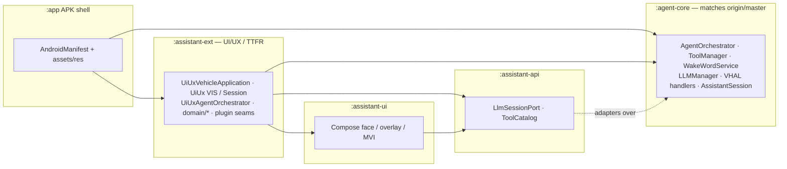
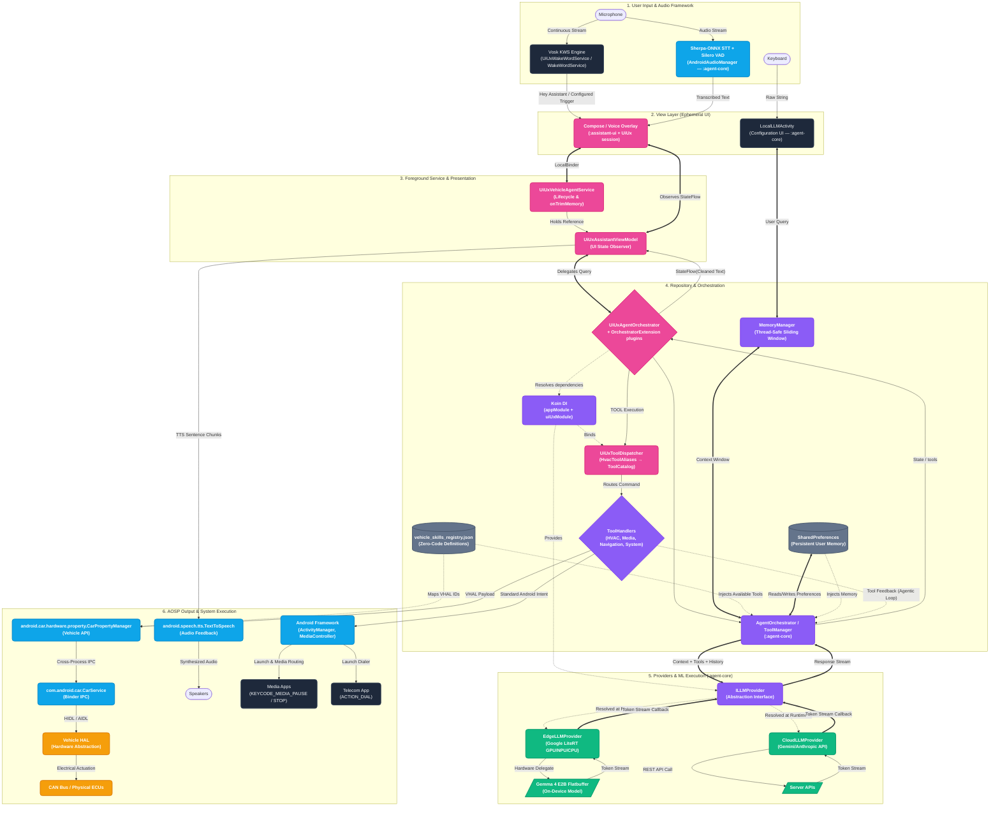

# Vehicle Assistant Architecture

This document outlines the complete architecture, components, technologies, and data flow of the **VehicleAssistant**. The application provides ultra-low latency, completely offline, LLM-powered voice assistance with deep, dynamic integration into Android Automotive OS (AAOS) VHAL (Vehicle Hardware Abstraction Layer).

**Branch posture (`dev/ui`):** product behavior still matches `origin/master` for the agent / VHAL / STT / LLM core. UI/UX, Compose face/overlay, TTFR, and plugin seams live in additive Gradle modules so this branch can rebase onto a fast-moving master without rewriting shared agent Kotlin. Policy details: [docs/architecture/refactor_extension_policy.md](architecture/refactor_extension_policy.md).

---

## Gradle modules & how this branch sits on `master`

The installable product is still one APK (`:app`), but source ownership is split so master-owned agent code and UI/UX extensions do not share the same tree.

| Module | Owns | Relation to `origin/master` |
|---|---|---|
| **`:app`** | Application shell: `AndroidManifest.xml`, assets, most `res`, local AARs, unit-test contracts | Manifest/resources may add UI/UX entries; **no** agent Kotlin under `app/src/main/java` |
| **`:agent-core`** | Master-owned Kotlin (orchestrator, VIS session, VHAL handlers, LiteRT, wake word, DI `appModule`, …) + shared agent `res` | **Byte-identical** to `origin/master` `app/src/main/java` (enforced by `MasterOwnedTreeContractTest`) |
| **`:assistant-ext`** | UI/UX / TTFR extensions: Compose session host, `UiUx*` services/VM/orchestrator, domain ports, HVAC aliases, plugin seams | Additive only — never merged into `:agent-core` packages |
| **`:assistant-ui`** | Compose face, overlay, immersive/gallery chrome, `AssistantBackend` / host contracts | UI presentation module |
| **`:assistant-api`** | Host-neutral ports (`LlmSessionPort`, `ToolCatalog`) | Thin API boundary used by extensions |

### Runtime entry points on this branch

Selected by manifest / XML (not by editing master-owned Kotlin):

1. **`UiUxVehicleApplication`** — loads `appModule` + `uiUxModule`.
2. **`UiUxAssistantVoiceInteractionService`** — system-bound VIS; starts `UiUxWakeWordService` (Compose) or legacy `WakeWordService` (XML profile).
3. **`UiUxAssistantSessionService`** — chooses Compose vs XML session; referenced from `voice_interaction_service.xml`.
4. **`UiUxVehicleAgentService`** — foreground agent host used by the UI/UX path.
5. Legacy master types (`AssistantVoiceInteractionService`, `VehicleAgentService`, `AssistantSession`, …) remain in `:agent-core` for parity and XML fallback, but are not the system-bound path.

### Syncing with `origin/master`

1. Fetch `origin/master`.
2. Copy / verify master Kotlin into `:agent-core` (`agent-core/src/main/java/...` ↔ `origin/master:app/src/main/java/...`).
3. Merge or rebase for docs/tests/resources; resolve modify/delete by keeping agent Kotlin **out of** `:app`.
4. Keep UI/UX behavior in `:assistant-ext` / `:assistant-ui` / `:assistant-api`.

Contract file: `app/src/test/resources/master_owned_kotlin.txt`. Roadmap notes: [docs/architecture/decoupling_roadmap.md](architecture/decoupling_roadmap.md).

---

## Technical Stack & AI Engines Overview

| Technology Layer | Framework / Library | Primary Role | Implementation File |
|---|---|---|---|
| **Hotword Detection** | **Vosk Offline KWS** | Continuous offline acoustic wake word detection (`"Hey Assistant"` / configured setting) | [WakeWordService.kt](agent-core/src/main/java/com/tcs/vehicleassistant/WakeWordService.kt) · UI path: [UiUxWakeWordService.kt](assistant-ext/src/main/java/com/tcs/vehicleassistant/wakeword/UiUxWakeWordService.kt) |
| **Speech-to-Text (STT)** | **Sherpa-ONNX + Silero Neural VAD** | Real-time offline voice activity detection and speech recognition | [AndroidAudioManager.kt](agent-core/src/main/java/com/tcs/vehicleassistant/hardware/AndroidAudioManager.kt) |
| **On-Device LLM** | **Google LiteRT (Flatbuffers)** | Hardware-accelerated (GPU / NPU / CPU) model execution for Gemma 4 E2B | [LLMManager.kt](agent-core/src/main/java/com/tcs/vehicleassistant/LLMManager.kt) & [EdgeLLMProvider.kt](agent-core/src/main/java/com/tcs/vehicleassistant/llm/EdgeLLMProvider.kt) |
| **Cloud Fallback LLM** | **Google Gemini / Anthropic APIs** | Cloud LLM provider fallback for complex multi-step queries | [CloudLLMProvider.kt](agent-core/src/main/java/com/tcs/vehicleassistant/llm/CloudLLMProvider.kt) |
| **Vehicle HAL Integration** | **Android Automotive CarPropertyManager** | Direct AIDL/HIDL VHAL hardware read/write (HVAC, Windows, Seat Heaters) | [VehicleManager.kt](agent-core/src/main/java/com/tcs/vehicleassistant/VehicleManager.kt) & [HVACToolHandler.kt](agent-core/src/main/java/com/tcs/vehicleassistant/handlers/HVACToolHandler.kt) |
| **Media Subsystem** | **MediaSessionManager + Hardware Keycodes** | Multi-layer media control (`KEYCODE_MEDIA_PAUSE`, `KEYCODE_MEDIA_STOP`) | [MediaToolHandler.kt](agent-core/src/main/java/com/tcs/vehicleassistant/handlers/MediaToolHandler.kt) |
| **Architecture Pattern** | **Clean MVVM + Repository + Koin DI** | Agent core + additive UI/UX DI (`appModule` + `uiUxModule`) | [AgentOrchestrator.kt](agent-core/src/main/java/com/tcs/vehicleassistant/repository/AgentOrchestrator.kt) · [UiUxAgentOrchestrator.kt](assistant-ext/src/main/java/com/tcs/vehicleassistant/repository/UiUxAgentOrchestrator.kt) · [AppModule.kt](agent-core/src/main/java/com/tcs/vehicleassistant/di/AppModule.kt) · [UiUxModule.kt](assistant-ext/src/main/java/com/tcs/vehicleassistant/di/UiUxModule.kt) |
| **UI / Face / Overlay** | **Jetpack Compose (`:assistant-ui`)** | Assistant face, overlay chrome, immersive surfaces | [assistant-ui](assistant-ui/src/main/java/com/assistant/ui/assistant/) · host wiring in `:assistant-ext` |
| **Host API ports** | **`:assistant-api`** | LLM session + tool catalog contracts for extensions | [LlmSessionPort.kt](assistant-api/src/main/java/com/assistant/api/llm/LlmSessionPort.kt) · [ToolCatalog.kt](assistant-api/src/main/java/com/assistant/api/tools/ToolCatalog.kt) |
| **Testing & Quality** | **5-Layer Automated Verification Suite** | Automated JUnit verification of wake word, silence guard, tools, media, feedback | [AutomatedArchitectureVerificationTest.kt](app/src/test/java/com/tcs/vehicleassistant/AutomatedArchitectureVerificationTest.kt) · master-tree contract in `MasterOwnedTreeContractTest` |

---

## Core Architecture Overview

### High-Level Architecture Stack

Logical domains stay MVVM + foreground service orchestration. On `dev/ui`, the View/UI and presentation bindings are primarily served by `:assistant-ext` + `:assistant-ui`, while repository/provider/VHAL code remains in `:agent-core`.

```mermaid
block-beta
  columns 1

  block:SLIDE
    columns 1
    
    block:VEA
      columns 1
      VEA_TITLE["<span style='font-size:20px; font-weight:bold; color:#FFFFFF;'>VehicleAssistant APK (:app shell)</span>"]
      
      block:L1["<span style='font-weight:bold; color:#FFFFFF;'>1. View & UI Layer (:assistant-ui + :assistant-ext)</span>"]
        columns 3
        ACT["<span style='color:#FFFFFF'>Configuration UI<br/>(LocalLLMActivity)</span>"]
        SESSION["<span style='color:#FFFFFF'>Compose / Voice Overlay<br/>(UiUx session + face)</span>"]
        APPS["<span style='color:#FFFFFF'>Target Apps</span>"]
      end
      
      block:L2["<span style='font-weight:bold; color:#FFFFFF;'>2. ViewModel & Service Layer</span>"]
        columns 2
        VM["<span style='color:#FFFFFF'>UiUxAssistantViewModel<br/>(+ master AssistantViewModel)</span>"]
        SVC["<span style='color:#FFFFFF'>UiUxVehicleAgentService<br/>(Foreground & Memory)</span>"]
      end
      
      block:L3["<span style='font-weight:bold; color:#FFFFFF;'>3. Repository & Orchestrator Layer</span>"]
        columns 2
        ORCH["<span style='color:#FFFFFF'>UiUxAgentOrchestrator<br/>→ AgentOrchestrator</span>"]
        DI["<span style='color:#FFFFFF'>Koin: appModule + uiUxModule</span>"]
      end
      
      block:L4["<span style='font-weight:bold; color:#FFFFFF;'>4. Data & Provider Layer (:agent-core)</span>"]
        columns 4
        EDGE["<span style='color:#FFFFFF'>EdgeLLMProvider<br/>(Google LiteRT)</span>"]
        CLOUD["<span style='color:#FFFFFF'>CloudLLMProvider<br/>(Gemini/Anthropic)</span>"]
        TM["<span style='color:#FFFFFF'>ToolManager (RAG)</span>"]
        MEM["<span style='color:#FFFFFF'>Context Memory</span>"]
      end
    end
    
    block:L5["<span style='font-weight:bold; color:#FFFFFF;'>5. AOSP Framework</span>"]
      columns 5
      CPM["<span style='color:#FFFFFF'>CarPropertyManager</span>"]
      AM["<span style='color:#FFFFFF'>ActivityManager</span>"]
      MEDIA["<span style='color:#FFFFFF'>MediaController</span>"]
      TTS["<span style='color:#FFFFFF'>TextToSpeech</span>"]
      STT["<span style='color:#FFFFFF'>Sherpa-ONNX STT</span>"]
    end
    
    block:L6["<span style='font-weight:bold; color:#FFFFFF;'>6. Vehicle Hardware Layer</span>"]
      columns 2
      VHAL["<span style='color:#FFFFFF'>Vehicle HAL (CAN)</span>"]
      AUDIO["<span style='color:#FFFFFF'>Audio HAL</span>"]
    end
  end

  %% Connections
  L1 -- "<span style='color:#FFFFFF; font-weight:bold;'>Observes StateFlow</span>" --> L2
  L2 -- "<span style='color:#FFFFFF; font-weight:bold;'>Delegates Queries</span>" --> L3
  L3 -- "<span style='color:#FFFFFF; font-weight:bold;'>Invokes Interfaces</span>" --> L4
  L4 -- "<span style='color:#FFFFFF; font-weight:bold;'>Cross-Process IPC</span>" --> L5
  L5 -- "<span style='color:#FFFFFF; font-weight:bold;'>Hardware Bridge</span>" --> L6

  %% Professional Dark Theme Styling
  classDef appBox fill:#0F172A,stroke:#818CF8,stroke-width:2px;
  classDef vmBox fill:#0F172A,stroke:#38BDF8,stroke-width:2px;
  classDef repoBox fill:#0F172A,stroke:#A78BFA,stroke-width:2px;
  classDef dataBox fill:#0F172A,stroke:#F472B6,stroke-width:2px;
  classDef aospBox fill:#0F172A,stroke:#FBBF24,stroke-width:2px;
  classDef halBox fill:#0F172A,stroke:#34D399,stroke-width:2px;
  
  classDef layer1 fill:#000000,stroke:#818CF8,stroke-width:2px,stroke-dasharray:5 5;
  classDef layer2 fill:#000000,stroke:#38BDF8,stroke-width:2px,stroke-dasharray:5 5;
  classDef layer3 fill:#000000,stroke:#A78BFA,stroke-width:2px,stroke-dasharray:5 5;
  classDef layer4 fill:#000000,stroke:#F472B6,stroke-width:2px,stroke-dasharray:5 5;
  classDef layer5 fill:#000000,stroke:#FBBF24,stroke-width:2px,stroke-dasharray:5 5;
  classDef layer6 fill:#000000,stroke:#34D399,stroke-width:2px,stroke-dasharray:5 5;
  
  classDef veaWrapper fill:#111118,stroke:#A855F7,stroke-width:3px;
  classDef titleBox fill:transparent,stroke-width:0px;
  classDef slideBox fill:#09090B,stroke-width:0px;

  class ACT,SESSION,APPS appBox
  class VM,SVC vmBox
  class ORCH,DI repoBox
  class EDGE,CLOUD,TM,MEM dataBox
  class CPM,AM,MEDIA,TTS,STT aospBox
  class VHAL,AUDIO halBox
  
  class L1 layer1
  class L2 layer2
  class L3 layer3
  class L4 layer4
  class L5 layer5
  class L6 layer6
  
  class VEA veaWrapper
  class VEA_TITLE titleBox
  class SLIDE slideBox
```

---

## Detailed Data & Execution Flow (Architecture Topology)

This diagram outlines the complete end-to-end data pipeline, demonstrating Sherpa-ONNX, Vosk KWS, LiteRT model execution, MVVM architecture, and VHAL API interaction. UI/UX wrappers sit in front of the same `:agent-core` engines.

---

## Detailed Component Specifications

### 1. Offline Wake Word Detection: `WakeWordService.kt` / `UiUxWakeWordService.kt`
- **Engine**: Offline Vosk Keyword Spotting (KWS) in `:agent-core`.
- **UI path**: `UiUxWakeWordService` in `:assistant-ext` wraps / parallels the master service for Compose hand-off.
- **Grammar & Matching**: Strictly configured for `"hey assistant"` or the user's custom setting wake word. Standalone single-word grammars are eliminated to prevent false triggers from background room noise.
- **Regex JSON Extraction**: Parses Vosk's JSON stream (`"(?:text|partial)"\s*:\s*"([^"]+)"`) to ensure clean text validation.

### 2. Speech-to-Text & Mic Hardware Hand-off: `AndroidAudioManager.kt`
- **Engine**: Sherpa-ONNX offline recognizer paired with Silero Neural VAD (`:agent-core`).
- **Microphone Retry Loop**: Features an automated 5-attempt retry loop with 150ms backoff intervals to seamlessly acquire the physical `AudioRecord` microphone hardware during hand-off from the wake-word service.
- **5-Second Silence Guard**: Enforces a 50-frame (5-second) maximum silence guard (`noSpeechFrames > 50`) to cleanly terminate recording and prevent UI lockup when the user is silent.

### 3. Google LiteRT Model Inference Engine: `LLMManager.kt` & `EdgeLLMProvider.kt`
- **Model**: Google Gemma 4 E2B `.bin` flatbuffers executed locally (`:agent-core`).
- **Hardware Acceleration**: Supports **GPU**, **NPU**, and **CPU** hardware delegates.
- **Persistent Preferences**: Saves and strictly respects user-selected hardware backend choices in `SharedPreferences` without mutating preferences during runtime fallbacks.
- **Multi-Turn Memory**: Preserves multi-turn conversation context across interactions without per-query resets, maximizing KV cache efficiency.
- **Extension adapters**: UI/UX code talks through `LlmSessionPort` / `LiteRtLlmEngine` rather than calling `LLMManager` directly.

### 4. Agentic Repository & Dynamic RAG: `AgentOrchestrator.kt` & `ToolManager.kt`
- **Repository Pattern**: `AgentOrchestrator` (`:agent-core`) remains the master source of truth for the agentic loop.
- **UI path**: `UiUxAgentOrchestrator` coordinates presentation, TTFR pipeline pieces, and `OrchestratorExtension` plugins (e.g. `MoodOrchestratorExtension`) without editing the master orchestrator body.
- **Baseline Core Tools**: `ToolManager` automatically injects baseline vehicle control tools (`stopMusic`, `playMusic`, `increaseTemperature`, `decreaseTemperature`, `setSeatHeater`) into every prompt.
- **Tool front-door**: `UiUxToolDispatcher` applies `HvacToolAliases` before `ToolCatalog` find/execute.
- **In-Context Few-Shot Learning**: System prompt embeds explicit few-shot turns for zero-code tool generation across all languages and phrasings.
- **Feedback Deduplication**: `AgentOrchestrator` applies `.distinct()` deduplication to tool feedback strings, preventing repeating responses.

### 5. Thread-Safe Context Memory: `MemoryManager.kt`
- **Thread Safety**: Uses `java.util.Collections.synchronizedList(mutableListOf<Turn>())` to guarantee thread safety across concurrent coroutine turns.
- **Durable Memory**: Auto-captures user preferences (*"remember I prefer 72 degrees"*) into durable `SharedPreferences`.

### 6. Non-Toggle Media Execution: `MediaToolHandler.kt`
- **Permanent Control**: Dispatches non-toggle `KEYCODE_MEDIA_PAUSE` and `KEYCODE_MEDIA_STOP` keycodes without sending `KEYCODE_MEDIA_PLAY_PAUSE`, ensuring media stays permanently stopped without resuming.

### 7. UI/UX extension surface (`:assistant-ext` + `:assistant-ui`)
- **Compose face & overlay**: presentation lives in `:assistant-ui`; session dismiss / idle timeout / profile receivers wire from `:assistant-ext` and the app manifest.
- **Dismiss overlay**: requires `GET_TASKS` / `REAL_GET_TASKS` / `PACKAGE_USAGE_STATS` so system-bar app switches can dismiss the assistant overlay.
- **Plugin seams**: `OrchestratorExtension` (`beforeQuery`, `onToken`, `onDone`, `stripDecorations`, `moodForDirectTool`, `onReset`) bound via Koin `getAll()`.

### 8. Automated Verification Suite
- **5-Layer JUnit Suite**: [AutomatedArchitectureVerificationTest.kt](app/src/test/java/com/tcs/vehicleassistant/AutomatedArchitectureVerificationTest.kt) — wake word matching, silence timeout, core tool injection, non-toggle media keycodes, feedback deduplication (`./gradlew testDebugUnitTest`).
- **Master-owned tree contract**: `MasterOwnedTreeContractTest` byte-compares `:agent-core` Kotlin to `origin/master` `app/src/main/java`.

---

## Communication Medium Details

* **View ↔ ViewModel**: Kotlin `StateFlow` (`uiState`) for continuous state updates (Idle, Listening, Thinking, Streaming). Kotlin `SharedFlow` (`events`) for one-off events (Toasts, Intent launching). UI path uses `UiUxAssistantViewModel` / `UiUxViewModelEvent`.
* **ViewModel ↔ Service**: `LocalBinder`. The voice interaction session binds to the UI/UX agent service via `bindService()` and accesses the ViewModel.
* **Orchestrator ↔ Providers**: Koin Dependency Injection. Agent core resolves `named("cloud")` / `named("edge")` providers; UI/UX adds `uiUxModule` bindings (`ToolCatalog`, `OrchestratorExtension`, pipeline ports).
* **Extensions ↔ Core**: `:assistant-api` ports + app/extension adapters over `LLMManager` / `ToolManager` — UI/UX depends on ports, not on editing master implementations.
* **Service ↔ Android OS**: Broadcast Intents for hardware button presses (PTT), idle/profile receivers, and `ComponentCallbacks2` for system-level memory events.
