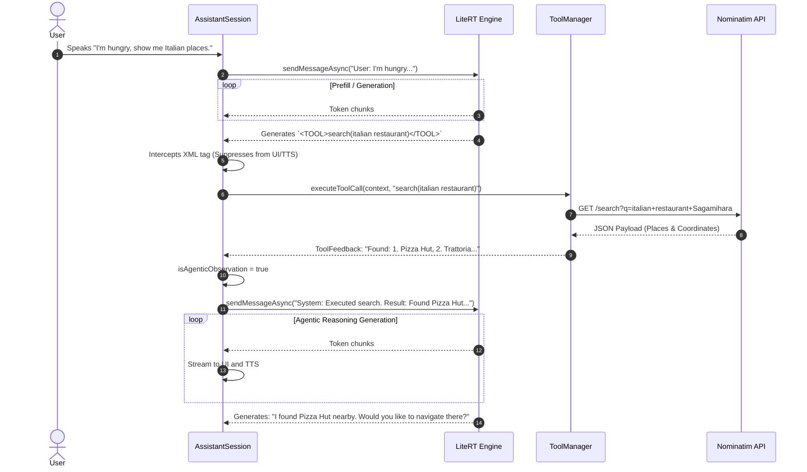

# Use-Case: Recursive Agentic Loop (Local Discovery)

This sequence diagram details the architecture's Agentic Loop. It triggers when the local LLM needs to use an external tool to fetch data before generating a final response (e.g., querying for nearby restaurants).

