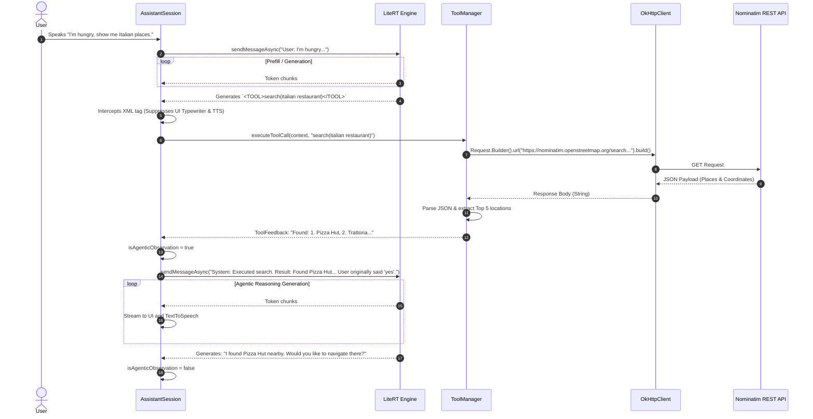

# Use-Case: Recursive Agentic Loop (Local Discovery)

This sequence diagram details the architecture's Agentic Loop. It explicitly models how `ToolManager` fetches external HTTP data and how `AssistantSession` manipulates the `isAgenticObservation` state to silently feed data back to the LLM.

