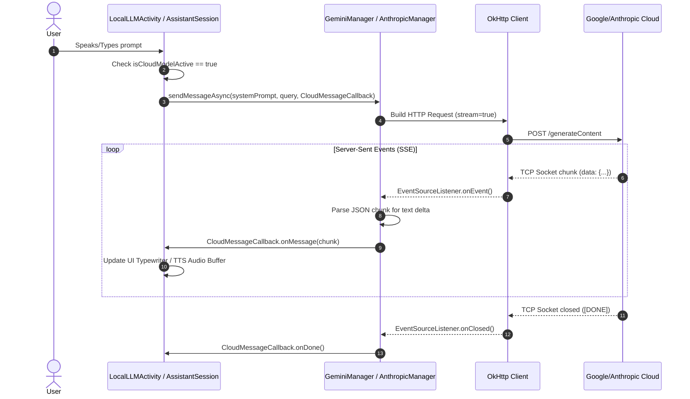

# Use-Case: Cloud Fallback Execution (SSE Streaming)

This sequence diagram illustrates the flow when the local edge model is disabled, and the system relies on Cloud APIs (Gemini/Claude). It highlights the use of Server-Sent Events (SSE) to maintain low-latency streaming to the UI.

