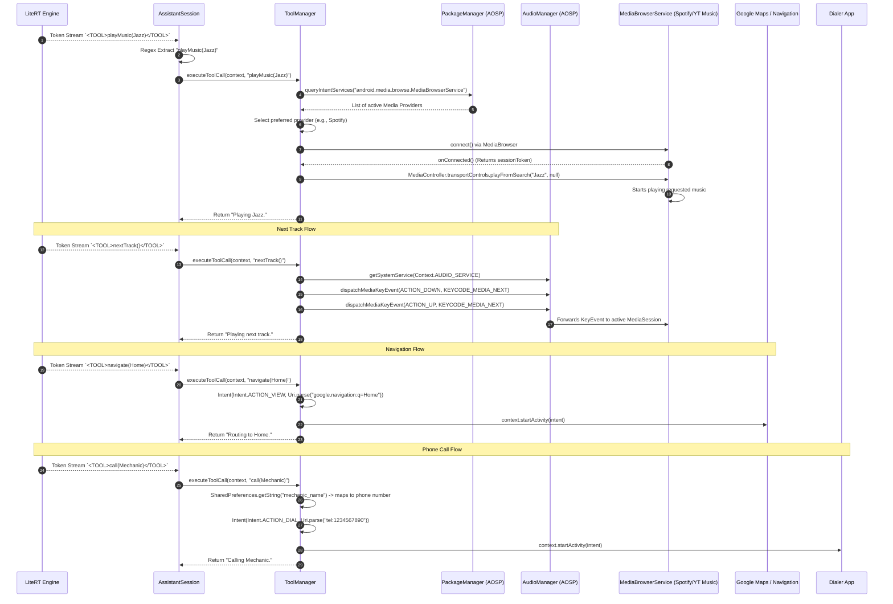

# Use-Case: Cross-Feature Intents & Media Controls

This diagram details the sequence when the LLM generates a tool call intended for another Android application. It highlights the use of standard Android Intents, the `MediaBrowserService`, and `AudioManager` for deep OS-level integration.

