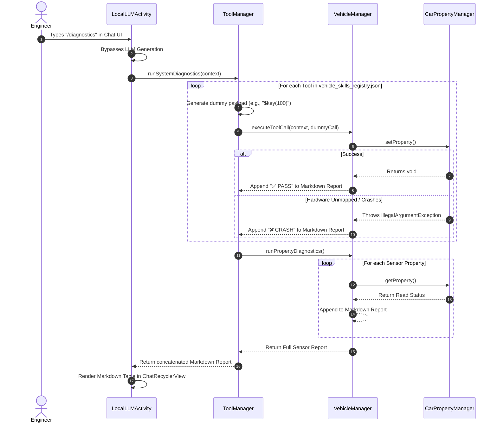

# Use-Case: Offline Hardware Diagnostics (/diagnostics)

This sequence diagram illustrates the debugging flow used by engineers to map unconfigured AOSP/Vendor Area IDs without compiling custom apps. It triggers a dry-run iteration over all defined tools.

