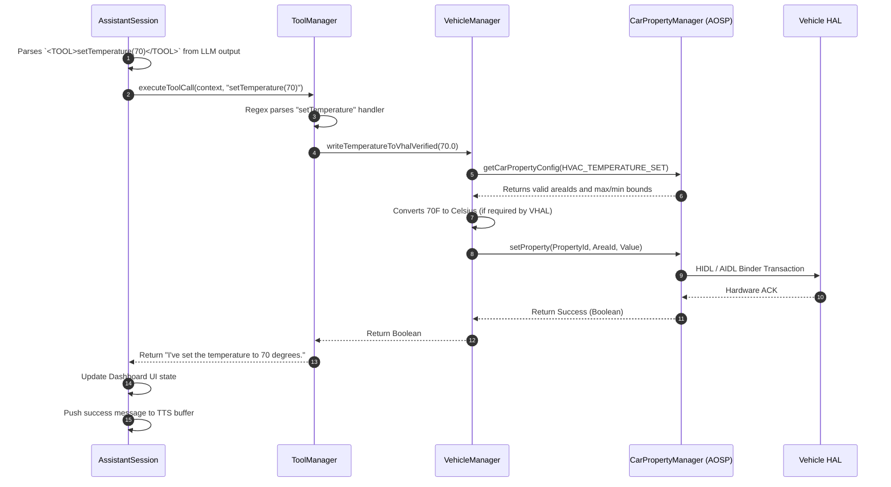

# Use-Case: Dynamic VHAL Hardware Actuation

This sequence diagram illustrates the data flow when the local AI Assistant executes a physical vehicle command (e.g., turning on the AC or rolling down windows) by communicating with the Android Car Service and the underlying Vehicle HAL.

