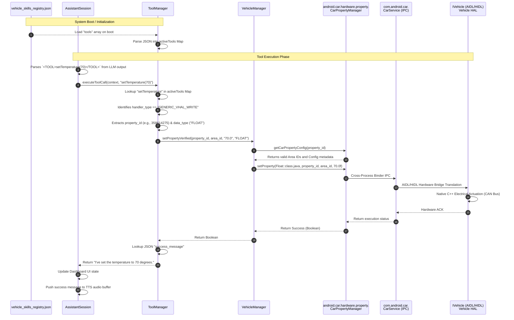

# Use-Case: Dynamic VHAL Hardware Actuation

This sequence diagram illustrates the data flow when the local AI Assistant executes a physical vehicle command. It details the initialization of the `vehicle_skills_registry.json`, the parsing of the `<TOOL>` tag, and the deep traversal through the Android OS layers down to the physical Vehicle HAL.

