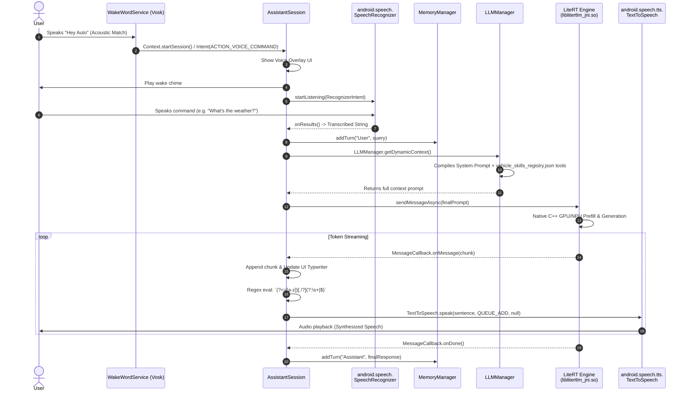

# Use-Case: End-to-End Voice Interaction (Local Inference)

This sequence diagram illustrates the data flow for a standard voice command processed entirely offline by the local LLM. It maps the exact Android Speech APIs and the C++ JNI bridge to the LiteRT engine.

