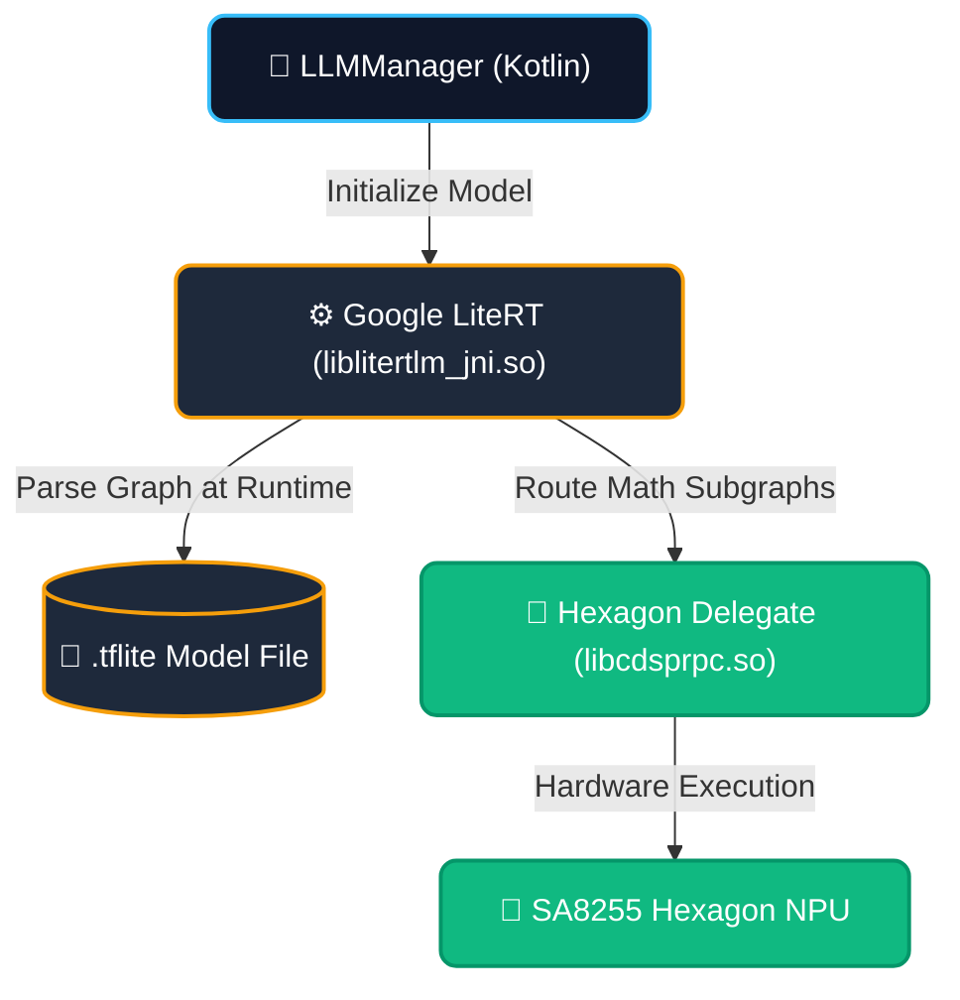
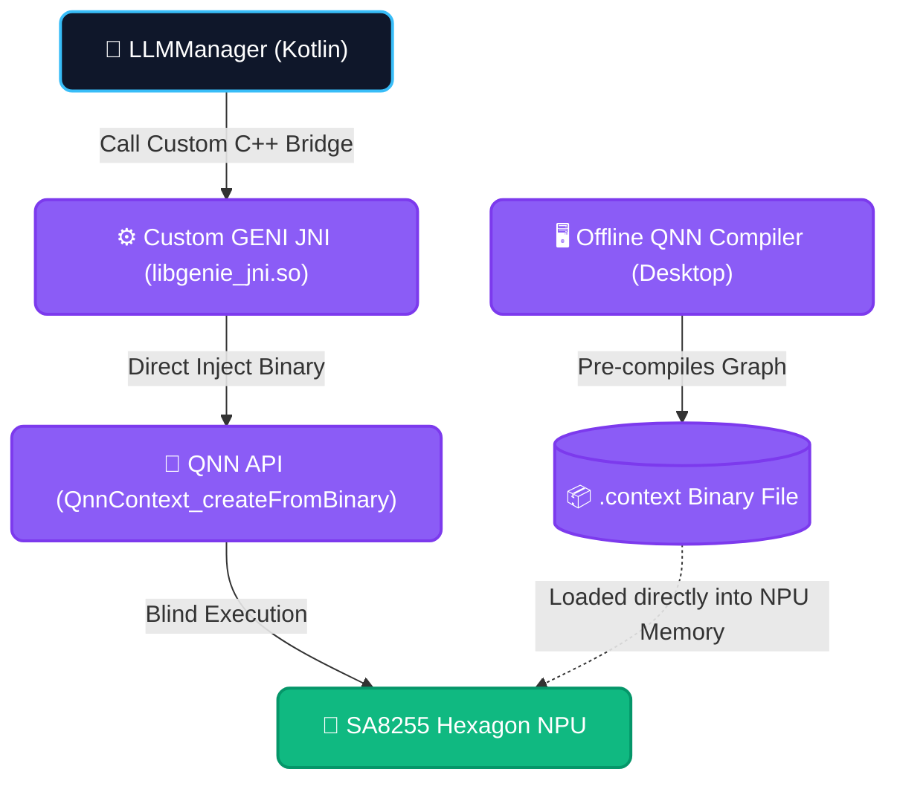

# Automotive AI Assistant Toolchain

This document outlines the complete software, hardware, and build toolchain utilized in the development, compilation, and deployment of the **VehicleEdgeAssistant** on the Android Automotive OS (AAOS) platform.

## 1. Core Build System & Languages

*   **Gradle (`./gradlew`)**
    *   **Purpose:** The primary build automation engine. It is used to orchestrate the complex compilation process, resolving dependencies, and packaging both the high-level Kotlin code and the low-level C++ Native Development Kit (NDK) binaries into a single, deployable Android Package (APK).
*   **Kotlin 1.8**
    *   **Purpose:** The modern, statically-typed programming language used for the entire Android application layer. It manages the Android component lifecycle, orchestrates the UI, handles asynchronous coroutines for background tasks, and acts as the "glue" binding the various AI libraries together.
*   **Python 3**
    *   **Purpose:** An auxiliary scripting language used purely for development and validation. It is utilized to rapidly parse raw device logs (via ADB), extract Time-To-First-Token (TTFT) metrics, and generate human-readable HTML performance reports without needing to recompile the Android app.

## 2. On-Device Inference Engine (LLM)

*   **Google LiteRT (`com.google.ai.edge.litertlm`)**
    *   **Purpose:** This is the core "brain" of the assistant. LiteRT (formerly TensorFlow Lite) is an ultra-optimized edge inference engine used to execute massive Large Language Models (like Qwen or Gemma) entirely on the local device. Running locally ensures absolute data privacy, zero internet dependency, and eliminates network latency round-trips.
*   **Native JNI Bridge (`liblitertlm_jni.so`)**
    *   **Purpose:** A C++ interface that allows the Kotlin application to talk directly to the LiteRT engine. This is critical because it forces the heavy matrix multiplication of the LLM to execute in native system RAM, entirely bypassing the Android Dalvik Virtual Machine. This prevents the Android OS from pausing the AI generation to run Garbage Collection.

## 3. Hardware Acceleration & Delegates

*   **GPU Delegate (OpenCL/OpenGL)**
    *   **Purpose:** Used by LiteRT to offload the LLM calculations to the Adreno GPU. It relies on the system-level `libOpenCL.so` and `libOpenCL-pixel.so` native libraries declared in the Android Manifest. GPUs are naturally designed for massive parallel processing, making them significantly faster at generating text tokens than a standard CPU.
*   **Hexagon DSP / NPU (`libcdsprpc.so` & `libQnnHtp.so`)**
    *   **Purpose:** Qualcomm-specific hardware accelerators. If a model is quantized to INT4 or INT8, these libraries bypass the GPU and run the AI directly on the Neural Processing Unit via the Qualcomm Neural Network Hexagon Tensor Processor (`libQnnHtp.so`). This is used to achieve the absolute lowest power consumption and thermal footprint while maintaining high inference speeds.

## 4. Acoustic & Semantic AI Support Libraries

*   **Vosk Offline Speech Recognition (`com.alphacephei:vosk-android`)**
    *   **Purpose:** An acoustic model library used exclusively for "Wake Word" detection. It runs continuously in the background, listening for the phrase "Hey Auto." Because it is a highly specialized, tiny model, it can listen 24/7 without draining the vehicle's battery or requiring an active microphone stream to the cloud.
*   **MediaPipe Tasks Text (`com.google.mediapipe:tasks-text`)**
    *   **Purpose:** A machine learning framework from Google used specifically to power the `TextEmbedder` inside the `SemanticSearchManager`. When a user speaks, MediaPipe converts their sentence into a dense 100-dimensional mathematical vector. This allows the Vector RAG system to understand the *meaning* of the sentence (e.g., matching "freezing" to the "increaseTemperature" tool) rather than relying on brittle keyword matching.

## 5. UI, Security, and Automotive Framework Libraries

*   **System Privileges (`android.uid.system`)**
    *   **Purpose:** Declared in the AndroidManifest, this allows the app to run as a highly privileged system app, granting it silent access to dangerous vehicle permissions (`android.car.permission.CONTROL_CAR_CLIMATE`, etc.) without prompting the driver.
*   **CarPropertyManager (`android.car`)**
    *   **Purpose:** The critical bridge between the high-level Android OS and the vehicle's physical hardware. It allows the LLM orchestrator to securely read live telemetry (like battery level or tire pressure) and write actuation commands (like rolling down windows) directly to the CAN bus via the Vehicle HAL.
*   **VoiceInteractionService (`android.service.voice`)**
    *   **Purpose:** A deeply integrated Android system service used to draw the assistant UI. By hooking into this service, the assistant can appear as a floating, transparent bottom-sheet overlay on top of *any* active application (like Google Maps).
*   **AOSP Intent Routing (`SpeechRecognizer`, `MediaBrowserService`, `ACTION_VIEW`)**
    *   **Purpose:** Instead of reinventing the wheel, the `ToolManager` relies on standard AOSP intents. It routes music commands directly to `MediaBrowserService`, navigation commands to `geo:` URI intents, and transcribes spoken audio using the native `android.speech.SpeechRecognizer`.

## 6. Testing & Validation

*   **JUnit 4 & AndroidJUnitRunner**
    *   **Purpose:** The automated testing frameworks used to validate the AI's behavior before deployment. Because LLMs are non-deterministic and prone to "hallucinating" incorrect syntax, these tools are used to run hundreds of simulated voice commands against the model on actual hardware, guaranteeing that the AI outputs the exact XML tool tags required to safely actuate the vehicle.

## 7. Future Platform Migration (Qualcomm SA8255 Snapdragon Ride Flex)

Transitioning to production SA8255 hardware involves two potential architectural paths to maximize Hexagon NPU TOPS (Tera Operations Per Second):

## 7. Local Vector RAG (Retrieval-Augmented Generation) Pipeline

To prevent the LLM from hallucinating non-existent tools and to handle unpredictable human language, the toolchain implements a completely offline, zero-latency **Vector RAG** engine. 

### What RAG Engine is Used?
The project utilizes the **MediaPipe Universal Sentence Encoder** (`com.google.mediapipe:tasks-text`) to perform mathematical embedding. There is no external vector database (like Pinecone or ChromaDB); everything is cached natively in Android memory via `SemanticSearchManager.kt`.

### How the Vector RAG Converts and Matches Data
The pipeline operates in three distinct phases:

1. **Initialization (Embedding the Registry):**
   When the app boots, it parses the `vehicle_skills_registry_v2.0.json`. For every tool, it flattens the schema, description, and keywords into a single descriptive sentence (e.g., `"Tool: increaseTemperature. Prompt: <TOOL>increaseTemperature()</TOOL>. Keywords: warmer, cold."`). 
   The Universal Sentence Encoder converts this sentence into a **dense 100-dimensional mathematical vector**. These vectors are cached in a local HashMap.

2. **Semantic Matching (Cosine Similarity):**
   When the user speaks (e.g., *"My hands are freezing"*), the same engine embeds the user's query into a mathematical vector. The system then calculates the **Cosine Similarity** (the angle between the vectors in 100-dimensional space) between the user's query and every tool in the cache. 
   Because it is matching math rather than exact strings, it correctly maps *"freezing"* to the `increaseTemperature` tool even if the word wasn't explicitly programmed.

3. **Mathematical Keyword Boosting & Context Injection:**
   To guarantee 100% precision for deterministic automotive actions, the system applies a **`+0.3f` mathematical boost** to the cosine similarity score if any of the predefined JSON keywords exactly match the user's query. 
   Finally, the system truncates the list to the **Top 4 Tools**. These tools are dynamically injected into the `LLMManager` system prompt inside a strict `<AvailableTools>` XML schema. By limiting the context window to only 4 highly relevant tools, the 1.5B edge LLM is forced to output the correct syntax, completely eliminating "Conversational Bypassing" and hallucinations.

4. **Tool Call Extraction & Execution (The Feedback Loop):**
   Once the LLM generates the final response (e.g., *"Adjusting climate. <TOOL>increaseTemperature()</TOOL>"*), the `ToolManager` engine takes over. 
   *   **Regex Parsing:** It uses a strict Regular Expression (`<TOOL>(.*?)</TOOL>`) to intercept the raw string before it reaches the Text-to-Speech (TTS) engine, stripping the XML from the user's ears.
   *   **Handler Routing:** It parses the command name and arguments, cross-references them against the `ToolHandlerRegistry`, and passes the payload to the correct handler (e.g., `HVACToolHandler` or `MediaToolHandler`).
   *   **Hardware Actuation:** The handler finally executes the command via the Android `CarPropertyManager`, physically actuating the CAN bus.

## 8. Future Platform Migration (Qualcomm SA8255 Snapdragon Ride Flex)

Transitioning to production SA8255 hardware involves two potential architectural paths to maximize Hexagon NPU TOPS (Tera Operations Per Second):

### Approach A: The Hybrid Pipeline (LiteRT + Hexagon Delegate)
This is the standard stepping stone for OEMs transitioning codebases to Snapdragon hardware.
*   **Engine:** Retain Google LiteRT (`litertlm`) as the primary execution wrapper.
*   **Model Format:** Use a Qualcomm-optimized `.tflite` model (INT8/INT4 quantization specifically trained for Snapdragon).
*   **Execution Flow:** When initializing LiteRT in Kotlin, attach the **Hexagon Delegate**. LiteRT parses the `.tflite` file and dynamically offloads the mathematical subgraphs directly to the NPU via `libcdsprpc.so`.
*   **Pros & Cons:** Extremely easy to implement since it uses standard Android APIs. However, it suffers from minor framework overhead because the `.tflite` graph must be parsed and delegated at runtime.

### Approach B: The Native Pipeline (Raw QNN + GENI Interface)
This is the ultimate production target. You abandon the Google LiteRT framework entirely and integrate directly with Qualcomm's Native Generative AI SDK (Genie / QNN AI Engine Direct).

#### 1. Offline Model Compilation
Instead of shipping a `.tflite` file, you compile the model **offline** on a workstation using the Qualcomm SDK (`qnn-context-binary-generator`). This strips out all framework overhead and produces a raw `.context` binary. The NPU can blindly execute this binary without needing to "understand" the graph.

#### 2. Implementing the GENI Interface
To execute this on the device, you must rewrite the `LLMManager` backend:
*   **Drop LiteRT:** Remove the `litertlm` dependencies and `liblitertlm_jni.so`.
*   **Custom JNI Bridge:** Write a new C++ Native layer that imports the Qualcomm QNN headers.
*   **Load Context:** Use `QnnContext_createFromBinary()` to directly inject the `.context` file into the Hexagon DSP. Because it is pre-compiled, initialization latency drops from seconds to milliseconds.
*   **Zero-Copy Execution:** Implement ION/Gralloc Shared Memory (via `QnnMem_register()`) to pass the KV Cache and token arrays between the CPU and NPU without copying bytes across memory boundaries. 
*   **Pros & Cons:** Requires a custom C++ integration and complex memory management, but yields the absolute lowest Time-To-First-Token (sub-300ms) and minimal thermal battery drain.

### Architectural Differences Summary

| Feature | Approach A (Hybrid LiteRT) | Approach B (Native QNN/GENI) |
| :--- | :--- | :--- |
| **Model Format** | `.tflite` | `.context` (Raw Pre-compiled Binary) |
| **Graph Parsing** | Parsed by the CPU at runtime | Pre-compiled offline (No runtime parsing) |
| **Engine Interface** | Generic `liblitertlm_jni.so` | Custom `libgenie_jni.so` (Qualcomm Headers) |
| **Memory Management** | Standard Android Native RAM | ION/Gralloc Shared Memory (Zero-copy) |
| **Development Effort** | Low (Standard Android APIs) | High (Custom C++ Memory Management) |
| **Latency (TTFT)** | ~500ms - 1000ms | **Sub-300ms** |

### Industry Standard Rationale (Why Approach B is Mandatory for SOP)

While Approach A is excellent for rapid prototyping, **Approach B (Native QNN) is the strict industry standard** for Tier-1 OEMs aiming for Start Of Production (SOP). The automotive industry mandates this native migration for three critical reasons:

1. **Thermal Throttling & Power:** Google LiteRT (Approach A) is fantastic for prototyping because it's so easy to use. However, because it still relies on standard Android memory and CPU parsing, it burns more power. In a car, the infotainment unit has strict thermal limits. The Native QNN approach runs "closer to the metal," drawing significantly less power and preventing the SoC from thermal throttling on hot days.
2. **Zero-Copy Memory:** Automotive manufacturers are obsessed with latency. The industry standard requires **ION/Gralloc** shared memory (which is only possible through custom C++ QNN/Genie integration). This allows the massive AI context to sit in a single block of memory that both the CPU and NPU can read simultaneously without copying it back and forth, which is the secret to getting sub-300ms TTFT.
3. **Security:** A `.context` binary is a compiled blob of hardware-specific instructions. It is much harder to reverse-engineer or tamper with than a generic `.tflite` file, fulfilling OEM cybersecurity and intellectual property requirements.
